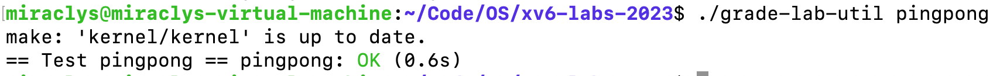
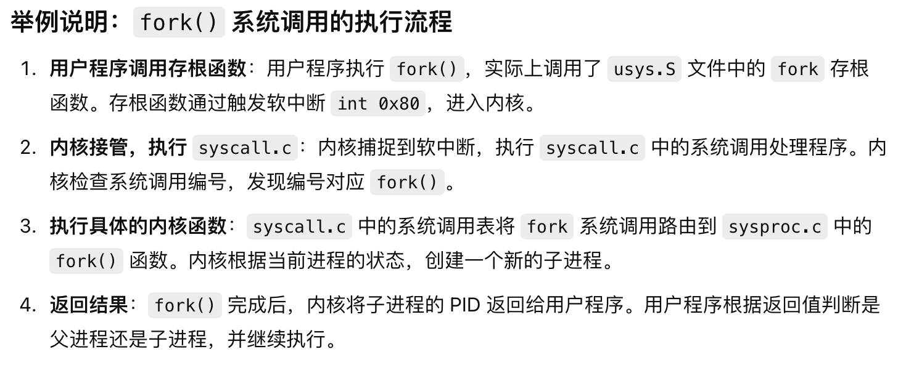
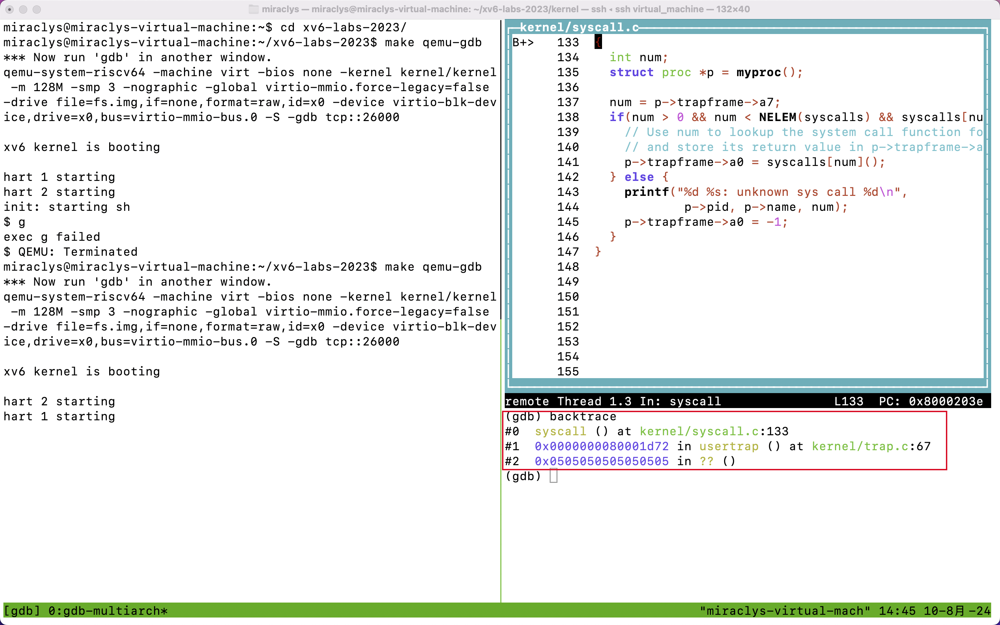
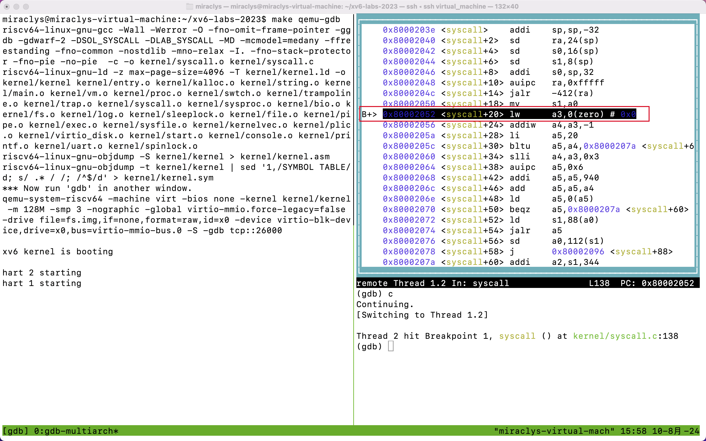
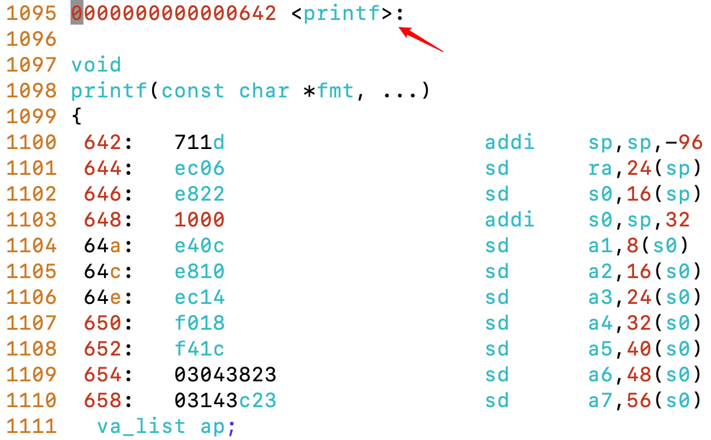
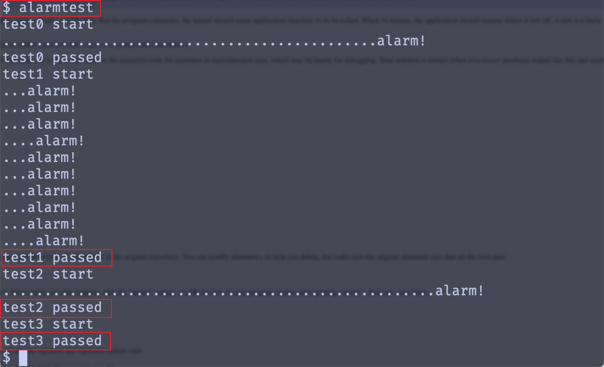
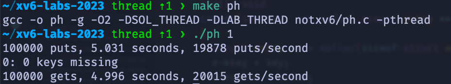
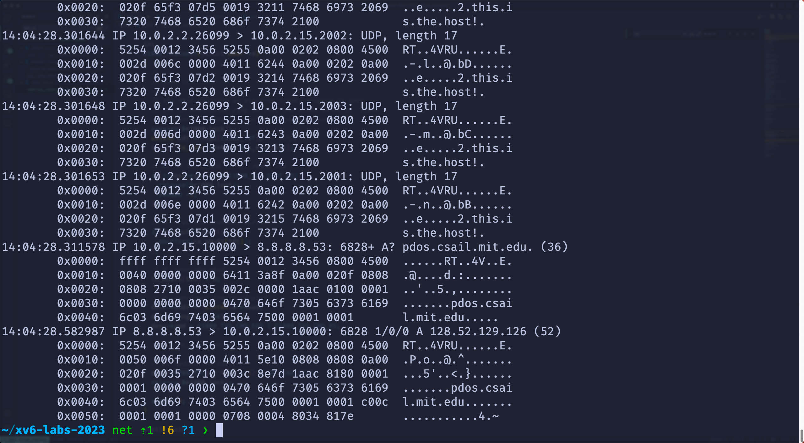

### 参考链接

1. https://www.chens.life/posts/
2. https://csdiy.wiki/%E6%93%8D%E4%BD%9C%E7%B3%BB%E7%BB%9F/MIT6.S081/#_3
3. https://github.com/Iuriak/OS-Xv6-Lab-2023/tree/util
4. https://xv6.dgs.zone/
5. https://th0ar.gitbooks.io/xv6-chinese/content/content/cover.html
6. https://mit-public-courses-cn-translatio.gitbook.io/mit6-s081
7. https://github.com/ranxian/xv6-chinese
8. https://github.com/relaxcn/xv6-labs-2022-solutions/tree/main
9. https://github.com/weijunji/xv6-6.S081
10. https://ttzytt.com/

### Guiadnce

**Only when you have a firm grasp of the assignment and solution, then start coding.**

`xv6` 是一个教学操作系统，它是早期 UNIX 第六版（UNIX V6）的简化版本，用于教学目的，帮助学生和开发者学习操作系统原理。

`RISC-V` 是一种开源的指令集架构（ISA），是一种与硬件无关的标准，定义了计算机处理器如何执行指令。`RISC-V` 以其简洁和灵活性著称，广泛用于教学、研究以及硬件设计中。`xv6` 可以移植到 `RISC-V` 上，以便在支持 `RISC-V` 架构的硬件上运行。

`xv6` 可以被**编译成**能够在 `RISC-V` 处理器上运行的二进制代码。这使得 `xv6` 可以运行在真正的 `RISC-V` 硬件上，或是通过仿真器模拟运行。

`QEMU` 是一个开源的仿真器，它可以模拟多种硬件平台，包括 `RISC-V` 架构的系统。通过 `QEMU`，开发者可以在没有物理 `RISC-V` 硬件的情况下运行和测试 `xv6`。

- You may find that your print statements produce a lot of output that you would like to search through; one way to do that is to run `make qemu` inside of `script` (run man script on your machine), which logs all console output to a file, which you can then search. Don't forget to exit `script`.

  使用 linux 中的 script 命令可以将终端的输入和输出都记录到一个文件中，可以方便地记录整个控制台会话的内容。

  在终端中运行 `script` 命令，例如：`script output.log`，这将会开始记录所有的终端输出到 `output.log` 文件中。

  接着运行 `make qemu`，这时所有 `qemu` 的输出都会被记录到 `output.log` 中。

  当你完成调试后，输入 `exit` 来结束 `script` 会话，这样所有的输出都保存在 `output.log` 文件里。

- being able to single step through some assembly code or inspect variables on the stack is helpful. To use gdb with xv6, run make make qemu-gdb in one window, run gdb-multiarch (or riscv64-linux-gnu-gdb) in another window (if you are using Athena, make sure that the two windows are on the same Athena machine), set a break point, followed by followed by 'c' (continue), and xv6 will run until it hits the breakpoint. See [Using the GNU Debugger](https://pdos.csail.mit.edu/6.828/2019/lec/gdb_slides.pdf) for helpful GDB tips. (If you start gdb and see a warning of the form 'warning: File ".../.gdbinit" auto-loading has been declined', edit ~/.gdbinit to add "add-auto-load-safe-path...", as suggested by the warning.)

- 在编译 `xv6` 内核时，Makefile 会生成一个名为 `kernel/kernel.asm` 的文件，这个文件包含**内核的汇编代码**。可以通过查看 `kernel.asm` 来了解 xv6 内核生成了哪些汇编指令，或者想查看某个内核地址对应的汇编指令。

- 当内核由于某些原因崩溃的时候，系统会输出包含程序计数器 sepc 的错误信息，对应着内核崩溃的时候执行的指令地址。

  可以搜索 `kernel.asm` 文件查找对应函数位置，也可以使用 `addr2line` 命令（`addr2line -e kernel/kernel pc-value`）来将程序计数器地址转换为内核中的具体代码。

- 如果你想获取内核的回溯信息（backtrace），可以使用 GDB 调试工具。首先在一个窗口中运行 `make qemu-gdb`，在另一个窗口中运行 GDB（或 `riscv64-linux-gnu-gdb`）。接下来，你可以在 `panic` 函数处设置断点（`b panic`），然后继续运行程序（`c`）。当内核遇到断点时，输入 `bt` 命令可以获取回溯信息（即显示函数调用栈）。

- 如果内核在运行时出现挂起（可能是死锁导致的），可以通过 GDB 来调试挂起的原因。在一个窗口中运行 `make qemu-gdb`，在另一个窗口中运行 GDB。输入 `c`（continue）命令继续执行，当内核挂起时，在 GDB 窗口中按 `Ctrl-C` 停止执行，然后输入 `bt` 命令来获取回溯信息。

  用途：当内核挂起时，使用 GDB 进行调试，可以帮助你找出内核在什么地方挂起，并了解挂起前的函数调用情况。

- QEMU 提供了一个监控功能，允许你查询虚拟机的状态。可以通过按 `Ctrl-a c` 进入 QEMU 的控制台（console）。一个非常有用的命令是 `info mem`，它可以打印当前的页表信息。如果系统有多个 CPU 核心，你可能需要使用 `cpu` 命令来选择查看哪个核心的页表，或者可以通过 `make CPUS=1 qemu` 来启动只有一个核心的 QEMU。

  用途：使用 QEMU 的监控功能，可以查看虚拟机的状态，如页表信息。这在调试内核虚拟内存管理问题时非常有用。

#### xv6 启动顺序

1. 引导程序

   xv6 使用 RISC-V 架构时，**引导程序**的传统功能被 QEMU 简化，QEMU 直接加载内核并执行。引导程序（如果存在的话）主要负责从硬盘读取内核并加载到内存中，然后跳转到内核的入口点。但在 RISC-V 环境中，QEMU 会直接执行内核，跳过这个步骤。

   如果是在其他架构下，可能会有实际的引导程序负责从磁盘读取内核，并将控制权交给内核的启动入口函数。

2. 内核初始化

   当控制权移交给 xv6 内核时，内核会按照以下顺序进行初始化

   - **`entry.S`**（汇编代码的入口点）

     xv6 内核的入口是汇编代码 **`entry.S`**，该文件负责一些底层的硬件初始化，例如设置页表、启用分页、切换到内核栈、初始化CPU等。

     `entry.S` 最终会调用 C 语言的 **`main()`** 函数，正式进入内核的主要初始化流程。

   - `main.c` 的 `main()`

     **`main()`** 函数是内核的主入口，它执行以下关键的初始化任务：

     - **初始化 CPU 的核心组件**：如 `consoleinit()` 初始化控制台设备，`trapinit()` 初始化中断机制。
     - **初始化进程管理系统**：如 `procinit()` 初始化进程表。
     - **初始化内存管理系统**：如 `kinit()` 初始化物理内存分配器。
     - **初始化文件系统**：如 `fileinit()` 和 `iinit()`，这两个函数分别初始化文件表和文件系统。
     - **挂载文件系统**：将 `fs.img` 文件系统挂载为根文件系统。

3. 内核初始化完以后，创建第一个用户进程

   `main()` 调用 `userinit()`

   `main()` 完成内核的初始化后，会调用 **`userinit()`** 函数。该函数的作用是创建第一个用户进程（`init` 进程）。

   `userinit()` 会将 `init` 程序加载到内存中，并创建一个新的进程控制块（PCB），为 `init` 进程分配内核栈和用户栈，并设置它的初始上下文。`init` 是 xv6 系统中第一个用户态进程。

4. 开始调度进程

   `userinit()` 创建 `init` 进程后，内核调用调度器，开始调度用户进程的执行。

   **调度器** 会选择 `init` 进程运行。内核通过进程切换机制，将控制权交给 `init` 进程。

5. `init` 进程

   `init` 进程是第一个在xv6系统中运行的用户态进程。它的代码在 `user/init.c` 中定义。

   `init` 进程的主要任务是启动系统的基本用户环境，并启动 `shell` 程序：

   - `init` 首先通过 `fork()` 创建一个子进程，然后在子进程中通过 `exec()` 加载并执行 shell 程序（`sh`）。
   - 如果 shell 程序启动失败，`init` 会在一段时间后重试，确保 shell 程序最终启动成功。

6. 用户程序的执行。

   在 shell 环境下，用户可以运行各类用户程序，比如 `ls`、`cat`、`echo` 等。这些程序的执行流程通常如下：

   1. 用户在 shell 中输入命令（例如 `ls`）。
   2. shell 调用 `fork()` 创建一个新的子进程。
   3. 在子进程中，shell 调用 `exec()` 加载并执行用户程序（例如 `ls`）。
   4. 用户程序执行完毕后，子进程退出，shell 等待子进程结束后继续接受用户输入。

**参考链接：**

1. https://eagain.net/articles/git-for-computer-scientists/ git 的使用

代码在概念上可能比较复杂而且细节比较多，确保完全掌握并且理解了以后再开始编码。

Although most C programs never need to cast between pointers and integers, operating systems frequently do. 所以在看见一个加法的时候要注意是指针加还是整数加。

### xv6 Book

#### Chapter 1

>The xv6 kernel provides a subset of the services and system calls that Unix kernels traditionally offer. 

xv6 提供了传统的 Unix 系统内核提供的服务和系统调用的子集。


> The xv6 shell is a simple implementation of the essence of the Unix Bourne shell. Its implementation can be found at (user/sh.c:1).

xv6 的 shell 是 Unix Bourne shell 的简单本质实现，具体实现可以在 `user/sh.c:1` 中找到。

很多时候，像 shell，在执行一段命令的时候，先 `fork` 后其实是立即 `exec` 了。那么为什么不将这两个系统调用合并呢？

shell 在实现 IO 重定向的时候其实是利用了这种分离的，并且为了优化 `fork` 调用后立即 `exec`，操作系统内核使用了虚拟存储的技术例如 copy-on-write。

> the file descriptor interface abstracts away the differences between files, pipes, and devices, making them all look like streams of bytes. 

文件描述符抽象了文件、管道和设备之间的差异，使得它们看起来都像是**字节流**。

1. 一个电脑通常有着多个进程，但是只有一个内核。

2. 当一个进程想要去调用一个内核服务的时候，它调用一个系统调用，然后系统调用进入内核，内核进行一系列的服务然后返回。

3. 操作系统内核利用 **CPU 提供的硬件保护机制**，这些机制确保进程之间的隔离，特别是用户进程不能随意访问系统内存或其他进程的内存。

4. 剩余的部分将介绍进程、内存、文件描述符、管道和文件系统。

5. shell 的本质其实是一个用户程序，而不是 kernel 的一部分

6. 常见的 Unix/Linux 系统中有多种 shell 可供选择，如 **Bourne shell (sh)**、**Bash**、**Zsh**、**Csh** 等。每种 shell 都有各自的命令语法、特性和脚本编程能力。

   而在 xv6 中，shell 是基于**Unix Bourne shell** 的一个简化实现。Bourne shell (sh) 是 Unix 早期操作系统中的经典 shell，它定义了许多标准的命令语法和脚本功能。

7. xv6 中 shell 实现可以在 `user/sh.c` 中找到，这个文件包含了 `xv6` 中 shell 的源码。

8. 在 xv6 中，每个进程由两部分，**用户空间内存和内核私有状态**。

   用户空间内存有代码、数据和栈，这部分是进程在用户模式下运行时所使用的。

   内核私有状态有**内核为每一个 CPU 维护的一些状态信息**，如进程的 CPU 寄存器、页表、PID（进程标识符）等，这些是 OS 用来管理进程的关键数据。

9. `exit` 可以释放资源，比如说内存和打开的文件。

10. `exec` 系统调用的作用是**替换掉**执行它的进程的**内存**，将一个新文件加载到该进程的内存中，这个文件通常是一个可执行文件，**包含新的指令和数据**。

    也就是说，**原进程的用户空间内存（包括代码段、数据段、栈区等）全部被新程序替换**，但是内核空间不变，如进程表项、PID 等等。

11. 当用户在 shell 中输入命令如 "echo hello" 时，shell 首先会调用 `fork` 系统调用。这会创建一个当前 shell 进程的副本，即一个新的子进程。

    子进程通过调用 `exec` 系统调用来加载并执行用户指定的程序，如 `/bin/echo`，并将命令行参数传递给这个程序。在这个例子中，参数列表是 ["echo", "hello"]。

    也就是说，shell 是创建子进程，然后执行 `exec`。

12. 文件描述符是一个小整数，用于表示**由内核管理的对象**，这些对象可以是文件、目录、设备或者管道，它提供了一种**字节流抽象**机制，这样，程序在处理 I/O 操作时，**不需要关心具体的对象类型，而只需处理字节流即可**。这种抽象使得 I/O 操作更加一致和简化。

13. `cat` 函数的实现，它并不知道输入和输出的对象是文件、管道还是什么，这就是文件描述符抽象的作用体现。

14. `fork` 和 `exec` 配合，fork 以后，用户内存和内核内存都继承原程序的内容， `exec` 会替换掉原来用户内存区域的内容为新程序内容，但是在内核空间中的文件描述符表仍然为父进程的部分。

    这种行为允许进程在调用 `exec` 时保持对文件描述符的控制，从而可以在新程序中继续使用这些文件描述符进行 I/O 操作。

    这种重定向操作**可以实现**：the shell has a chance to redirect the child’s I/O **without disturbing the I/O setup of the main shell**

    相反，如果我们将 `fork` 和 `exec` 合并起来，在执行合并的系统调用前，我们需要先改变 shell 自身的 IO，然后进行 systemcall，然后撤销这个修改。

15. 同时，这也是为什么说「父子进程的 file descriptor 是同样的」的原因。

16. `dup` 系统调用用于**复制一个现有的文件描述符**，并返回一个新的文件描述符。这个新的文件描述符和原文件描述符指向相同的底层 I/O 对象（如文件、设备等）。

    所以，`dup` 创建的新文件描述符其实和之前的文件描述符是共享偏移量等信息的。

17. 一个管道是小型的**内核缓冲区**，通过一对文件描述符**暴露**给进程，一个用来读，一个用来写。

    它提供了一种进程间通信的方式。

    ```C
    int p[2];
    char *argv[2];
    argv[0] = "wc";
    argv[1] = 0;
    pipe(p);
    if(fork() == 0) {
      close(0);
      dup(p[0]); // 先关闭标准输入，然后 dup，表示将管道的输入作为标准输入。
      close(p[0]); // 然后关闭 p[0] 和 p[1]，因此 dup 以后不再需要它们。
      close(p[1]); // 一定需要关
      exec("/bin/wc", argv);
    } else {
      close(p[0]);
      write(p[1], "hello world\n", 12);
      close(p[1]);
    }
    ```

18. 关闭文件描述符并不会影响与其关联的内核对象（如文件、管道等），只是在文件描述符表中移除了这个条目。内核对象的存在与否取决于其引用计数，当没有文件描述符引用它时，才会真正被销毁

19. `wc` 即 word count 是 Linux 或者 Unix 系统中的一个命令，主要作用是统计文件或输入的行数、单词数、字符数等信息。

20. **文件结束符（EOF）** 的概念是通过关闭写端实现的，所以我们要及时关掉不使用的管道的写端，以免读端无法收到 EOF 而一直读阻塞。

    如上面代码中的 `close(p[1])`，因为 `wc` 是基于标准输入工作的，它**依赖于管道的结束**符来判断何时完成读取。如果写端不关闭，`wc` 就无法知道数据已经写完，从而无法收到 EOF 信号，**导致 `wc` 一直阻塞，无法正确退出**。

21. 管道 pipe 和临时文件 temporary files，虽然在某些情况下它们类似，比如说 `echo hello world | wc` 和 `echo hello world > /tmp/xyz; wc < /tmp/xyz` 这两个命令。

    虽然此任务而言，管道和临时文件都可以实现，但是管道相比临时文件至少有三大优势：

    - 管道会自动清理。管道是内存中的一种数据结构，由**内核**创建和销毁。操作系统内核会自动地去释放与管道相关的资源，而不需要用户显式地清理他们。

      而使用临时文件则需要用户手动去创建和删除文件。

    - 管道可以处理任意长度的数据流，而不依赖于磁盘的空间。

      因为在管道中，数据是直接从一个进程输出传递到另一个进程中。

      使用临时文件时，所有的数据**都需要先写入磁盘**，因此必须确保磁盘有足够的空间来存储所有数据，特别是在处理大数据量时，这可能成为瓶颈。

    - 管道允许多个命令同时执行。

      例如，`echo` 和 `wc` 可以同时运行，`echo` 产生数据的同时，`wc` 可以立即处理这些数据。允许命令同时处理，所以可以充分利用系统资源。

      使用临时文件时，`echo` 必须完全写完数据，`wc` 才能开始读取并处理文件。这导致了**两个命令的串行执行**，无法充分利用并行计算的优势。

22. `mkdir` 创建一个新的文件夹；`mknode` 创建一个新的设备文件。

23. **设备文件（device file）** 是操作系统中用于与硬件设备进行交互的特殊文件。它们通常位于 `/dev` 目录下，允许用户程序像操作普通文件一样，通过 **读** 和 **写** 操作与设备**进行通信。**

    设备文件并不真正存储数据，而是**充当接口**，将读写请求传递给内核中对应的设备驱动程序，进而与实际硬件设备交互。

24. 文件名不同于文件本身，文件的实际数据和元数据被存储在一个称为 `inode` 的结构中。

    一个文件可以有**很多名字，叫做 `links`**。

    每一个 `link` 都是目录中的一个条目，这一个条目**包括了一个文件名和对于 `inode` 的引用。** 

    即一个实际文件的多个不同的 **硬链接（hard link）** 可以有不同的文件名，但它们指向的 **inode** 是同一个。因此，这些不同的文件名实际上代表的是同一个底层文件。

25. 像 mkdir、ln、rm 这样的命令，都是被添加的 user-level 的程序，而不是 shell 中自带的，因为它们本质都是 shell 先 fork 然后 exec 执行。但是 cd 命令则不是，它是嵌入在 shell 内部的，因为它改变的就是 shell 本身的路径。

26. 当调用 `unlink`（或 `rm`）删除文件时，文件的**目录项**会被删除，但文件的 **inode** 和实际内容并不会立即被删除。

    这时，文件名在文件系统中已经不存在，但文件内容仍然保留在磁盘上，直到以下两个条件同时满足：

    - **没有文件描述符** 再指向该文件的 inode。
    - **没有目录项**（硬链接）再指向该文件的 inode。

    也就是说，link 和 unlink 都只是对于文件的**目录项**进行操作。但是如果**没有了目录项**，可能有正在运行的程序中还有 fd 指向对应的 inode，只有等 fd 也没有了以后再真正删除对应的文件。

    这也是 fd 指向 inode 而不是指向目录项的原因吧，因为 inode 表示实际存在的文件，目录项只是一个 link 或者叫名字。

#### Chapter 2

> To achieve strong isolation it’s helpful to forbid applications from directly accessing sensitive hardware resources, and instead to abstract the resources into services. 

为了实现强隔离，禁止应用程序直接访问敏感的硬件资源，而是将资源抽象到服务中，这是很有帮助的。

> Many forms of interaction among Unix processes occur via file descriptors. 

Unix进程之间的许多交互形式都是通过文件描述符实现的。

Xv6 内核源码位于 `kernel/` 的子目录下，源代码按照模块化的粗略概念划分为多个文件，模块间的接口在 `kernel/defs.h` 中定义。


Xv6 先声明一个栈空间，这样就可以调用 C 语言编写的程序进行更多的初始化工作，比如调用 `kernel/start.c` 。此后，`start.c` 设置 `mstatus` 寄存器和 `mepc` 寄存器保证执行 `mret` 指令的时候进入管理模型并且调用 `main` 函数。

`kernel/main.c` 中初始化了多个系统和子系统，这些操作为后续操作系统的运行奠定了基础。

在 `kernel/syscall.h` 中可以看见系统调用的编号


`initcode.S` 是利用 RISC-V 汇编语言编写的一个简单程序，通过调用 `exec` 系统调用（上图中的 7）加载并执行 `/init` 程序，这是操作系统启动后执行的第一个用户程序。

通过发出 `exec` 系统调用，`initcode.S` 请求内核加载并启动新的用户进程，从而完成了系统的初始化并进入了正常运行状态。

`syscall` 函数从陷入上下文中（即 `trapframe`）提取系统调用号，并根据该号查找对应的系统调用处理函数。例如，当系统调用号对应 `exec` 时，`syscall` 会调用 `sys_exec` 函数来处理具体的系统调用。

1. 操作系统的三个要求：

   - multiplexing
   - isolation
   - interaction

2. 为了实现**强隔离**，操作系统禁止应用程序直接访问敏感的硬件资源，取而代之的是操作系统**将这些资源抽象**为**服务**。

   应用程序通过系统调用来使用这些服务，而不是直接操作硬件。

3. 在 Unix 系统中，应用程序通过 `exec` 系统调用**加载自己的内存映像**，**而不是直接操作物理内存**。操作系统决定进程在物理内存中的位置，必要时还可以将一些进程的数据暂存到磁盘上。这种抽象让用户可以方便地管理可执行文件，而无需关心底层的内存分配。

4. 现代 **CPU 提供**了硬件支持来实现强隔离。以 RISC-V 为例，它有三种模式：（RISC-V 有三种模式，而不是说 xv6 特有）

   - **机器模式（machine mode）**：权限最高的模式，通常用于系统启动和配置 CPU。系统启动时，CPU 运行在机器模式下。
   - **监控模式（supervisor mode）**：操作系统内核运行在这个模式下，允许执行特权指令（如启用或禁用中断、读写页表寄存器等）。
   - **用户模式（user mode）**：用户程序在这个模式下运行，不能执行特权指令。用户模式下的程序只能访问自己的内存，不能直接访问内核的资源。

5. 用户程序运行在用户空间，只可以执行普通的用户级指令，无法直接访问硬件资源。

   操作系统内核运行在内核空间，可以执行特权指令，管理系统资源，如 CPU、内存和文件系统等。

6. RISC-V 提供了 `ecall`  指令让 CPU 从 user mode 切换到 supervisor mode 并且进入内核指定的位置。

   一旦 CPU 切换到 supervisor mode，内核就可以开始验证系统调用的参数，比如检查地址是否合法等等

   内核的入口点是内核控制的， 而不是应用程序，因为如果是应用程序的话，就会又一些恶意程序直接跳转到已经执行完 validate arguments 的地方，从而产生一些问题。

7. 操作系统中的一个关键问题是：哪些部分应该运行在监控模式 supervisor mode 下，具有完全的硬件访问模式；哪些部分应该运行在用户模式 user mode 下。

   对于这一个问题，一种常见的操作系统设计模式是**单体内核 monolithic kernel**（Unix 和 Windows 都属于单体内核）。在这一种设计模式下，整个操作系统都在内核空间中运行，**所有的系统调用**都在监控模式下执行。

   为了**减少内核中的错误风险**，操作系统设计者可以通过减少运行在特权模式下的代码量来提高系统的安全性。这个思想就是将操作系统的大部分功能转移到**用户模式（user mode）**下运行，只让最核心的部分运行在监控模式下。这种设计被称为微内核 microkernel。

   在微内核结构中，只有核心的操作系统功能（**如进程调度、基础的内存管理和硬件中断处理**）在内核空间运行，其他较**复杂的功能**（如文件系统、设备驱动、网络协议栈等）则在用户空间运行。

8. 系统调用通常是使用底层的**汇编语言**实现的，但大多数现代操作系统都提供了用**C语言**或其他高级语言编写的接口来封装这些系统调用，使开发者可以更加方便地使用它们。

   操作系统（如Linux、Windows等）会通过标准库（如`glibc`）提供对系统调用的封装。这意味着，尽管系统调用的**底层实现使用汇编**，但大多数开发者可以通过高级语言如**C、C++等调用这些系统接口**，而不需要直接编写汇编代码。

   对于 shell 中的命令，如 `mv`、`ls` 等等，其实是相当于一个应用程序，它们大多是使用 C 语言进行编写的。当我们执行这些 shell 命令的时候，其实是运行了一个 C 的程序。这些程序又使用 C 标准库封装的一些系统调用实现，而系统调用底层又是使用汇编实现。

9. 有些C函数直接映射到系统调用，几乎不做其他的处理或逻辑扩展。由于这些函数仅仅是系统调用的包装，开发者在使用这些函数时，实际上是在使用底层的系统调用，因此我们也可以直接称这些C函数为系统调用。

   虽然，比如说 `write` 函数，是 C 标准库封装的函数，它是标准哭对于底层系统调用 `sys_write`的封装，会通过汇编指令进入内核态，内核完成实际的写操作。

10. 微内核操作系统中有很多的 **server**，这些服务器是用户空间中运行的**独立进程**，它们负责**提供操作系统的各项服务**。传统上在内核中执行的任务（如文件系统管理、设备驱动、网络协议栈等）被分离出来，作为独立的服务器运行在用户模式下。

11. 许多操作系统最早是以宏内核设计的形式构建的，将所有的操作系统服务放在内核中。虽然宏内核可能更容易导致系统复杂性增加，但也可以避免进程间通信的开销，从而提高性能。因此，很多已有的操作系统继续沿用宏内核设计，而不急于重构为微内核。

12. Xv6 内核中各个文件的作用

    

    各个模块之间的接口定义在`defs.h`文件中，位于路径`kernel/defs.h`。`defs.h`文件包含了不同模块之间需要共享的函数、变量和结构体的声明，使得模块之间可以通过这些接口互相调用功能。它相当于xv6内核中所有模块之间的**接口契约**，规定了如何在不同模块之间进行交互。

    xv6的内核源码被划分为多个**文件**，每个文件通常对应某一个特定的功能或模块。这种划分方式体现了一种粗略的**模块化**思想。

13. Xv6 中的进程的内存空间中，首先是指令（也就是代码），然后是全局变量，接着是栈，最后是堆区。

    由于 RISC-V 是 64 位，并且硬件只使用最后的 39 位，然而 xv6 只使用其中的 38 位，所以最大的地址空间就是 $2^{38} - 1 = \mathrm{0xfffffffff}$，这也就是 MAXVA。

14. 在每个进程的地址空间顶部，xv6 保留了两个特殊的页面：

    - **Trampoline 页面**：这个页面保存了从用户模式切换到内核模式，或从内核模式切换回用户模式时**所需要执行的代码。**trampoline 本质上是一个跳板，帮助程序**从用户态“跳”到内核态**，完成系统调用或处理中断。
    - **Trapframe 页面**：trapframe 是用来**保存或恢复用户进程状态的必要信息**。每次进程进入内核模式时（比如系统调用或中断发生时），内核需要保存进程当前的执行状态，以便在返回用户模式时能够恢复继续执行。trapframe 主要保存寄存器、程序计数器等状态

15. 内核维护了进程的很多状态，一个进程最重要的几个内核状态是：page table、kernel stack（当进程进入内核模式时，使用内核栈来执行内核代码） 和它的运行状态 run state。

16. xv6 中一个进程只有一个执行 thread，虽然在一般的操作系统中，为了充分利用多核 CPU，一般会设置多个线程。

17. `ecall` 命令可以更改 CPU 的运行状态，如从用户到监视，然后将 PC 改为 `kernel-defined entry point`。

    内核入点处的代码可以将栈切换为内核栈然后执行实现系统调用的指令。

18. 在内核空间执行完命令以后，内核调用 `sret` 指令回到用户空间。

19. 每一个进程都有两个栈，一个是用户栈，一个是内核栈。用户栈用于执行用户代码时保存数据，内核栈则在进程进入内核后使用。

#### Chapter 3

> Xv6 runs on Sv39 RISC-V, which means that only the bottom 39 bits of a 64-bit virtual address are used; 

运行在 Sv39 上，所以只有最后的 39 位数字可以作为虚拟地址使用。

页面大小 $2^{12} = 4096$ Bytes，所以通过虚拟地址的前 27 位来寻找 PTE（页表项），每一个页表项包括一个 44 位的 PPN（物理页号）和一些标志位，这些标志位勇于控制访问权限和其他相关的页属性。

最后通过 44 + 12（页内偏移）得到 56 位的物理地址。

多级页表也有着内存效率优势。实际的例子是如果顶层索引对应的项是无效的（即这部分虚拟地址范围未被使用），则无需为这个索引下的整个512 × 512 × 4096字节（1GB）的虚拟地址空间分配中间层或底层页表。

如果顶层页表项有效，那么中间层页表根据虚拟地址的中间位（中层索引）进一步细分。同样地，如果中层索引对应的项无效，意味着这512 × 4096字节（2MB）的虚拟地址空间不需要底层页表。

每一个 PTE 有着一些 flg 位告诉硬件设备如何去使用对应的页，这些定义在 `kernel/riscv.h` 中可以找到。

为了告诉 CPU 使用特定的页表，内核必须将根页表的页物理地址写入 `satp` 寄存器。

内核地址空间是虚拟地址空间的一部分，专门为操作系统内核保留。在许多操作系统中，**虚拟地址空间被分为用户空间和内核空间两个部分。**

`walk()` 函数可以根据虚拟地址找到对应的 PTE。

**trampoline page** 主要用于在用户模式和内核模式之间进行上下文切换时，安全地执行必要的代码。这一页物理内存被映射在每个进程的用户地址空间的最顶部。这个映射对所有进程来说都是一样的，即每个进程的地址空间中都包含这个映射。

一个页的大小是 4096 Bytes，一个 PTE 的大小是 54 bits，并且还有 10 bits 可以扩展，也就是一个 PTE 最大为 64 bits，故一个页内最多有 4096 * 8 / 64 = 512 个 PTE（页表项）。

xv6 使用一个单独的页表来描述内核的地址空间，这意味着**所有的进程共享同一个内核页表**。但是每一个进程维护一个**独立的**页表，这个页表描述了用户态的地址空间。

xv6 的 kernel 内核是通过直接映射的方式

当系统调用或中断发生时，CPU会从用户模式切换到内核模式。在这个过程中，**内核栈**用于保存用户栈的上下文，并提供内核执行所需的栈空间，比如 `trapframe` 就是保存在内核栈中的。

|        函数        |                             作用                             |
| :----------------: | :----------------------------------------------------------: |
|      `walk()`      |              find the PTE for a virtual address              |
|    `mappages()`    |                 install PTE for new mappings                 |
|    `kvminit()`     | main calls kvminit to create the kernel's page table using kvmmake<br />（所有的进程都共享的那一个页表） |
| `proc_mapstacks()` | allocates a kernel stack for each process<br />（每一个进程都有自己的内核栈） |
|  `kvminithart()`   |                install the kernel page table                 |
|     `kinit()`      |                   initialize the allocator                   |
|     `kfree()`      |            用于释放内存页面，重新添加到自由列表中            |
|      `sbrk()`      | 用于增大或者缩小进程的堆内存区域<br />堆内存区域是进程用来动态分配内存的空间 |

1. 在 xv6 中，页表又一些特殊的应用技巧，比如xv6 可以将 **trampoline page** 映射到多个进程的地址空间中，trampoline page 是一个**特殊的页，允许进程在用户态和内核态之间进行切换**。尽管多个进程都有自己的地址空间，但它们可以通过页表共享这块内存。

   还可以通过未映射的页表保护栈，防止出现溢出的情况。用户栈和内核栈附近放置 **未映射的页面** 来防止栈的溢出。如果进程**访问**这些**未映射的页面**，**系统会触发异常**，从而防止进程错误地访问无效的内存。

2. 每一个进程都有一个自己的页表。

3. xv6操作系统运行在RISC-V的**Sv39**配置上，这意味着虽然虚拟地址是64位的，**但只有低39位是有效的**，用来参与地址转换。高25位被忽略。

4. 在 Sv39 配置中，一个 RISC-V **页表**逻辑上是一个包含 **$2^{27}$ 个页表项**（Page Table Entries, PTEs）的数组。

   每一个页表项都包含 **44 bit 的物理页号**（Physical Page Number, PPN）和**一些标志位。**

   当硬件将虚拟地址翻译为物理地址的时候，先取 39 位虚拟地址的前 27 位（因为页表就是 2 的 27 次幂的页表项）去页表 page table 中寻找对应的 PTE，然后使用 PTE 中的 44 位物理页号和虚拟地址的后 12 位组合，得到一个 56 位的物理地址。

5. Xv6 中一个页面是 4096 B，**注意页面和页表概念上的区别。**

6. 如果在地址转换过程中任何一个必需的PTE不存在，硬件会触发**页故障异常（page-fault exception）**，交由操作系统内核处理。

7. 虽然多级页表在内存使用上更为高效，但在性能上有一个潜在的缺点：

   为了完成一次虚拟地址到物理地址的转换，CPU必须从内存中加载三个PTE（分别来自三层结构的各一层），这可能导致较大的性能开销。

   为了解决这个问题，RISC-V CPU使用了一个称 **翻译后备缓冲区（Translation Look-aside Buffer, TLB）**的缓存机制。

8. 为了让 CPU 使用某个页表，内核必须将**根页表页的物理地址**写入一个叫做`satp`（Supervisor Address Translation and Protection）寄存器中。

   每一个 CPU 都有自己的 satp 寄存器，因此不同的CPU可以同时运行不同的进程，每个进程使用自己独立的地址空间（由自己的页表描述）。

9. 实际的 xv6 使用的是三级页表，前面一级的情况是为了解释。

10. 除了每个进程的页表外，xv6还维护**一个单独的**页表，描述整个系统的**内核地址空间**。这个内核页表在所有**进程之间共享**，确保内核能够访问物理内存和硬件资源。

11. 在QEMU仿真器中，模拟的物理内存从物理地址`0x80000000`开始，并且至少覆盖到`0x88000000`。这个范围是xv6中定义的物理内存的上限，称为`PHYSTOP`。

12. 内核空间和用户空间都是切实的一部分内存地址。

    内核空间是操作系统内核使用的内存区域，**存储内核代码、内核数据结构、设备驱动程序以及其他系统级资源**。内核空间对所有进程是共享的，但只有操作系统内核和特权模式下的代码才能访问。

    内核在管理与进程相关的资源时，会为**每个进程维护独立的数据结构**。这些结构包含了与该进程独立相关的资源信息，**即使在共享内核空间的情况下**，它们也是独立的。

    

13. 有很多的锁

    

14. 在 xv6 运行时，**内核**会为页表、用户内存、内核栈和管道缓冲**收集和释放**运行时的物理内存。

15. 对于运行时的分配，xv6 使用处于内核内存区域的最后到 `PHYSTOP` 这一段区域的内存。并且，每一次的释放和分配都是以 4096 B 为单位的，即 4KB 也就是一个页面的大小。

16. 为了有效管理哪些内存页是**空闲的**，哪些已经**分配出去**，Xv6 使用了一个简单的**空闲页链表**（free list）。

    对于页表的分配和释放都通过这一个 list 来实现。

17. 物理内存分配器的实现是位于 `kalloc.c` 中，分配器的数据结构是一个 free list

18. 在 Xv6 的内存分配器实现中，`free list` 和 `lock` 被封装在同一个结构体中。这种封装的目的是为了明确表达出**这个锁是专门用于保护这个 `free list` 的**。

19. 其中，`free list` 是由多个**空闲页**组成的链表，表示当前可以分配的物理内存页。**在实现中**，每个空闲的内存页，用 `struct run` 结构体表示，也就是 list 的元素。

20. `main` 函数调用 `kinit` 去初始化分配器，`kinit` 将 free list 初始化为从内核末尾到 PHYSTOP 的所有空闲 page 的 list。

21. 理想情况下，操作系统应该通过**解析硬件提供的配置信息**（例如 BIOS 或者引导加载程序提供的内存配置数据）来**确定**系统的物理**内存大小**。这种机制可以让操作系统自适应不同机器的内存大小。然而，Xv6 作为一个简化的教学操作系统，没有实现这个复杂的功能。

22. `kfree` 函数的作用是释放内存，将页面重新加入到**空闲页链表**中。

23. **悬空引用**是指一个指针仍然指向一段已经被释放的内存。如果释放后的内存仍然保持原来的内容，程序可能无意中继续使用这块无效内存，导致潜在的隐蔽错误。

    所以 `kfree` 通过将页表内的所有 byte 都置为 1，任何继续使用这块内存的代码都会读取到错误的值，可能会更快地导致程序崩溃，从而更容易发现问题。

    新释放的页面被放入 list 中的头部，然后更新 list 的头部。

24. **`kalloc`** 函数与 `kfree` 相反，它从空闲页链表中取出一个页面并返回。

25. 进程的地址空间分配

    

    

    下面是一种更详细的分配图。

26. 在 Xv6 中，每个进程的栈通常只有**一页**（即 4096 字节，4KB），用于存储局部变量、函数调用信息和其他临时数据。

    这里的栈是从高地址向低地址增长。

27. 在 Xv6 中，当一个进程通过 `exec` 启动时，操作系统会在栈的顶部为程序准备好**命令行参数字符串**，并在这些字符串下方创建一个**指针数组**（`argv`），指向这些字符串。

    在指针数组的下方，操作系统会设置**`argc` 和 `argv`** 相关的数据，使得程序启动时能够正确调用 `main(argc, argv)` 函数，就像一个普通的 C 程序那样。

    也就是说，相当于把 `main(argc, argv[])` 这一步会带来的变化，直接到位了，保证程序接下来可以直接执行。

28. `exec` 是 Xv6 中的一个系统调用，用来**加载一个新程序**到当前进程的地址空间中。`exec` 负责清除当前进程的用户内存并加载新的程序，同时初始化该程序的**栈**，包括处理程序启动时的命令行参数（如 `argv`）。

    然后就是 27 条中的操作。

29. **在 xv6 中，**为了检测用户的栈溢出，xv6 在栈空间的下方放置了一个不可访问的 guard page，这个 page 不可以在用户模式 user mode 下访问，一旦访问，就会出发 page-fault。

    然而，**现实中**，在一些更复杂的操作系统中，当栈溢出时，系统**可能会自动分配更多内存**给栈，而不会立即终止进程。这种机制更灵活，适合实际应用中的动态栈增长需求。

30. 最后一层 Page Table 的结构：

    

    PPN + Flags

31. **`sbrk`** 是一个系统调用，允许进程请求增加或减少其用户内存（通常是堆的大小）。

    在 Xv6 中，`sbrk` 系统调用的具体实现是通过调用 **`growproc`** 函数实现。

    **`growproc`** 函数用于增加或减少进程的内存，它根据传入的参数 **`n`** 来决定是扩展内存还是缩减内存：

    - 如果 `n` 是**正数**，表示进程请求更多的内存，调用`uvmalloc` 函数。
    - 如果 `n` 是**负数**，表示进程希望释放部分内存，调用 `uvmdealloc` 函数。。

    

    两个函数正好是对应的，都要对于表项进行操作，然后调用 kalloc 或者 free 函数。

    

32. 

#### Chapter 4

1. 三类事件会导致 CPU 暂停执行当前的指令，转而执行专门的代码处理这些事件。

   - 系统调用 system call，使用 `ecall` 去执行一些指令的时候
   - 异常 exception，指令执行出现错误、异常的时候
   - 设备中断 device interrupt，设备发起中断的时候

2. 通常，在陷阱发生时正在执行的代码稍后需要恢复，并且不需要知道发生了什么特殊情况，也就是说，我们**希望陷阱 trap 是透明的。**

3. 在 xv6 中 trap 的处理分为**四个阶段**

   - 由 RISC-V CPU 完成的硬件级别的动作。
   - 一些汇编指令用于为内核 C 代码做好准备。这些指令通常**负责保存当前状态并设置必要的上下文信息**。
   - 一个 C 函数决定 trap 类型如何处理。
   - 具体的系统调用实现或者设备驱动程序代码。

4. 处理 trap 的内核代码（汇编或者 C）通常称为 `handler`，第一个处理 `handler` 指令通常使用汇编书写（而不是 C），并且有的时候被称为向量（vector）。

5. 一些重要的 register 的功能表

   | 寄存器     | 作用                                                         |
   | ---------- | ------------------------------------------------------------ |
   | `stvec`    | 保存了 handler 程序的地址，CPU 跳转到此处去解决 trap         |
   | `sepc`     | 保存了发生 trap 的时候的 PC 的值                             |
   | `scause`   | 保存了 trap 发生的原因                                       |
   | `sscratch` | 在 handler 开始时，提供一个临时存储位置，用于保存 handler 程序的初步状态信息 |
   | `sstatus`  | 保存 CPU 的状态                                              |

6. SIE 为 1 的时候表示中断允许，0 的时候表示中断禁用。

7. 在 trap 发生时，**Kernel Sofware** 必须完成切换到内核页表、切换到内核堆栈和保存、恢复必要的寄存器状态。

   而 CPU 不会去完成这些操作。

8. 4.2 说的是 user code 发生的 trap，4.5 是 kernel code 发生的 trap

9. 来自用户空间的 trap 的高级路径是 uservec、usertrap，返回时是 usertrapret 和 userret。

10. xv6 处理 trap 的缺点是，用户空间的 page table 和内核空间的 page table 都需要有 `stvec` 寄存器对应的地址映射，这是因为 RISC-V 硬件在强制 trap 时不会切换页表，所以用户空间需要有，为了能够在切换后继续执行，内核页表也必须有一个指向`stvec`的处理程序的映射。

    这是因为一开始我没还没有进行寄存器状态的保存，而是将 handler 过程中的变量存储在 sscratch 中，所以用户的 page table 必须有对应的地址映射

11. 对于 `uservec` 寄存器中的 handler 是在 `trampoline` 页中的 trampoline.S。

    跳板页（trampoline page）中的内容不仅包括`trampoline.S`文件中的代码，还包括其他与trap处理相关的重要信息。

12. `trampoline` 页保存了一些关于切换的汇编程序和别的信息，`trapframe` 则用来保存寄存器的状态信息。

13. 用户空间的 **trap 流程**

    1. 用户空间发生 trap

       将 PC 保存到 spec，trap 原因保存到 scause，当前 CPU 状态保存到 ssttatus 中的 SPP 位，硬件控制权转移到 stvec 寄存器中的指定地址 uservec

    2. uservec 处理

       uservec 是汇编编写的 trap 处理程序入口，位于跳板页。

       首先保存 a0 到 sscratch 寄存器，将 a0 作为地址指针，然后保存 32 个通用寄存器到 trapframe 中。

    3. uservec 保存完以后，会调用 usertrap 进入内核处理。

       更改 stvec，将 stvec 寄存器的值该为 kernelvec，确保在内核模式下发生 trap 的时候由 kernelvec 处理。

       确定 trap 的原因，如果是系统调用，则调用`syscall`函数处理。

       如果是设备中断，则调用`devintr`函数处理。

       如果是其他异常，则终止出错的进程。

    4. 准备返回用户空间 usertrapret。

    5. 切换页表并返回用户空间 userret
    
14. 

#### Chapter 5

1. 用户在键盘上键入字符时，这些字符通过串口硬件 UART 传送到**控制台驱动程序**。

2. 用户程序例如 shell，通过 `read()` 系统调用从控制台获取输入。

3. UART 硬件有若干个控制寄存器，它们都是一个字节宽（8 位）。这些寄存器的内存偏移量定义在 `kernel/uart.c` 文件中，这些偏移量决定了每个寄存器相对于 `UART0` 的地址。

4. 一些关键的 UART 寄存器

   LSR 寄存器

   RHR 寄存器

   THR 寄存器

5. 介绍了 shell 从控制台获取输入的过程

6. 通过缓冲区和中断机制实现设备活动与进程活动的解耦。这种机制提高了系统性能，尤其是在处理较慢或需要即时响应的设备时，如 UART。

7. 驱动程序是**一段代码**，这一段代码控制着特别的设备。

   驱动程序的设计是很有技巧的，因为它需要和所管控的设备并行进行，并且它需要理解对应硬件的接口，因为这些接口总是会比较复杂的，并且厂商提供的文档往往不够详细或者难以理解。

8. 设备驱动程序有两部分工作模式，即上半部分(top half)和下半部分(bottom half)

   - 上半部分（top half）

     这部分代码在**进程的内核线程**中运行，通常是由系统调用（如 `read` 或 `write`）触发的。

   - 下半部分

     这段代码在**中断发生时**运行，即当设备完成某项操作并发出中断信号时，操作系统的中断处理程序会调用驱动程序的下半部分。

9. 举例了控制台驱动程序。

   用户在键盘上输入字符时，这些字符通过硬件接口（在 xv6 中通过 **UART** 模拟的 16550 芯片）被接收到。每当用户按下一个键，**UART 硬件**会触发**中断**。

   控制台驱动程序会**注册中断处理程序**，当中断发生时，它会被调用来处理输入的数据。

   在中断处理程序中，驱动程序的**下半部分（bottom half）**接收到输入的字符，将其存储到驱动程序维护的输入缓冲区中。

   控制台驱动程序维护了一个输入缓冲区（通常是环形缓冲区）用于暂存用户输入的字符，直到遇到回车，同时，输入还会处理backspace 或者 Ctrl + u。

   **然后**，操作系统中的进程比如说 shell 进程就可以通过 `shell` 系统调用来获取输入，这个系统调用实际上会进入内核，由内核向设备驱动程序请求输入数据。

   在控制台驱动程序中，通常是**按行处理用户输入**。也就是说，当用户进程（如 shell）调用 `read` 来请求数据时，驱动程序通常会等到**一行完整的输入**（例如用户按下了回车键）后，才将这一行字符提供给请求的进程。

   但是我们的 shell 中输入命令是实时显示的，这是因为**字符回显**和**完整的输入处理**是两个不同的过程。

10. **UART 硬件**对软件来说，表现为一组**内存映射的控制寄存器**。

    意味着在特定的物理地址范围内加载或者读取、写入这些地址的时候，不是与常规的 RAM 交互，而是直接与硬件设备交互。

    UART 硬件的内存映射起始地址为 **0x10000000**，这个地址被称为 **UART0**。它定义在 `kernel/memlayout.h` 文件的第 21 行。

    UART 硬件有多个**控制寄存器**，每个寄存器的大小为 **1 个字节**，它们相对于 **UART0** 起始地址有特定的偏移量。这些寄存器的偏移量定义在 `kernel/uart.c` 文件中。

    这些寄存器负责不同的功能，涉及 UART 的数据传输和接收。

    UART 的传输和接受过程是独立的，传输数据和接受数据的过程互不影响。

11. xv6 中实现的详细过程为

    

12. 函数 `devintr()` 是一个设备中断处理函数，用于处理不同来源的中断，主要来自外部设备（通过 PLIC）和计时器。

    也就是说，它并不是处理全部的中断。

    它主要处理了两类中断，**外部设备中断**和**计时器中断**。

    - 外部设备中断

      通过 PLIC（Platform-Level Interrupt Controller）传递的外部设备中断。

      这些中断通常来自外部硬件设备，如 UART（串口设备）、Virtio（虚拟磁盘设备）以及可能存在的网络设备（如 E1000）。这些设备会在需要操作系统响应时生成中断，`devintr()` 负责处理这些中断。

    - 计时器中断

      这是操作系统常用的时钟中断，用于时间片轮转、进程调度等定时任务。

13. 键盘输入的流程是：

    1. 当用户键入字符的时候，UART 硬件将这些字符存入其内部的 FIFO 缓冲区。

    2. 达到一定条件后，UART 硬件会产生一个接受中断，发送给操作系统。

    3. 中断请求触发 RISC-V 的陷阱处理程序，这个中断处理程序会调用 `devintr` 函数。

       在这一个函数中，会检查中断的来源，确认是 UART，并调用 uartintr

    4. uartintr 处理程序从 UART 的接收保持寄存器 RHR 读取**所有可用的字符**，直到 FIFO 缓冲区为空。

       每读取到一个字符，uartintr 就讲起传递给 consoleintr

    5. consoleintr 将收到的字符放入内核的输入缓冲区（注意，此时数据仍然在内核中，还没有拷贝到用户数据区） cons.buf 

       这一部分会处理特殊字符，如 backspace 和其他控制字符，直到 consoleintr 遇到换行符，表示用户这一行已经输入完毕

    6. 用户在输入字符时，这些字符被缓存在内核的 `cons.buf` 中，等待后续处理。

       如果用户没有输入完整的一行，`consoleintr` 不会返回给用户进程。

    7. 当用户进程（如 shell）调用 `read` 系统调用请求输入时，系统会调用 `consoleread`。

       `consoleread` 检查 `cons.buf` 中是否有完整的行（以换行符结尾）。

    8. 如果 `cons.buf` 中有完整的一行数据，`consoleread` 将其复制到用户进程的缓冲区中，返回给用户进程。

       如果没有完整行，`consoleread` 会使用户进程进入睡眠状态，等待更多输入。

14. `uartputc` 将输出字符添加到缓冲区并调用 `uartstart`，之后就可以让进程继续执行其他任务，而 UART 设备则在后台逐字节处理数据，通过中断和中断处理程序循环完成字符的输出。

    - `uartstart` 会检查 UART 设备是否正在发送数据（通过查看 UART 的状态寄存器）。

      如果 UART 空闲，`uartstart` 会从输出缓冲区中取出第一个字符，并交给 UART 设备发送。

      如果 UART 正在发送，`uartstart` 直接返回，不做任何操作。

    - `uartpuc` 返回，进程不需要等待整个数据发送完成。这意味着进程可以转而处理其他任务，不必被 UART 的逐字节发送过程阻塞。

    - UART 是一个串行通信设备，一次只能发送一个字节。当 UART 成功发送完一个字节后，它会产生**发送完成中断**，通知操作系统这个字节已经发送出去。

    - 当发送完成中断发生时，UART 的中断处理程序 `uartintr` 被操作系统触发执行。

      `uartintr` 的任务是处理这个中断，并调用 `uartstart` 来检查缓冲区中是否有更多待发送的字符。

    所以，后面其实是 uartintr 和 uartstart 的循环。

15. 我们平时在和终端或者命令行界面操作时，实际是**和控制台直接交互**，而我们输入的命令会被一个后台运行的程序 shell 处理。

    其实控制台和 shell 是独立的概念，但是在日常使用中，它们是紧密结合的，所以习惯上会混淆。

16. 控制台其实是用户和操作系统之间交互的一个桥梁或者接口，它的作用是在用户于操作系统或者应用程序之间传递和处理文字符号。

    它并**不负责处理命令本身**，而是负责捕获用户的输入的字符，以及显示系统的输出。

17. Xv6 使用定时器中断来维护其时钟，并使其能够在计算密集型进程之间切换。

    `usertrap` 和 `kerneltrap` 中的 `yield` 调用导致了这种进程切换。

    定时器中断来自于连接到每个 RISC-V CPU 的时钟硬件。Xv6 将这个时钟硬件编程为定期中断每个 CPU。

    RISC-V 规定定时器中断必须在机器模式下处理，而不是在监督模式下处理。RISC-V 的机器模式执行时不使用分页机制，并且拥有一套单独的控制寄存器，因此在机器模式下运行普通的 Xv6 内核代码是不现实的。因此，**Xv6 将定时器中断处理与前面讨论的 trap 机制完全分开。**

18. 定时器中断的基本流程：

    - 定时器硬件触发中断

      每一个 CPU 都连接着一个定时器硬件，在 RISC-V 上通常是 CLINT-Core Local Interrupt，XV6 将这个定时器设置为周期性触发中断。

      当时间到达时，定时器硬件会给 CPU 发送一个**定时器中断**，这是一个硬件中断，由硬件**在机器模式下处理**（不是监督模式）。

    - 定时器中断处理的入口是 `timevec`，这是一个在 xv6 中定义的汇编程序，在 kernelvec.S 中，会处理定时器中断的最初阶段。

    - `timevec` 是定时器中断的处理函数，它的职责是保存当前 CPU 的状态并进行最小化处理。

      主要是保存寄存器、设置下次中断时间、请求软件中断、恢复寄存器并返回

    - 机器模式下的软件中断会通过 RISC-V 的陷阱机制传递给 xv6 的内核，内核会通过普通的陷阱处理机制来处理这个软件中断

      这时，`kerneltrap` 函数就会被调用，来处理这个软件中断。

    -  `kerneltrap` 函数中，Xv6 内核会检查发生的中断类型。如果中断是由软件中断引发的（也就是定时器中断引发的软件中断），那么内核会调用 `devintr` 函数来处理。

19. 定时器中断虽然是硬件触发，但是中间还是以软件中断的形式进行处理

    这时因为机器模式（Machine Mode）是 RISC-V 中权限最高的模式，通常只用于**非常底层的硬件操作**，不适合运行普通的内核代码。

    通过将定时器中断转交给软件中断，Xv6 可以避免在机器模式下运行复杂的内核逻辑。软件中断通过陷阱机制**进入内核的监督模式（Supervisor Mode）**，这是 Xv6 内核正常运行的环境。

20. 因此，如果我们关闭了中断（具体来说时软件中断），即使是定时器硬件仍然会产生定时器中断，最终也不会通过软件中断机制进行处理，因此定时器中断的效果将不会再发生。

21. `kerneltrap` 和 `devintr` 之间的区别：

    `kerneltrap`:

    `kerneltrap` 负责处理所有发生在**内核态**的中断和异常。它的主要任务是处理 CPU 在内核态下发生的各种陷阱事件（包括中断、异常和系统调用）。

    - 检查中断/异常的来源。当一个 trap 发生的时候，CPU 跳转到 kerneltrap，此时它会检查 trap 的来源。
    - 处理中断。如果是来自中断（时钟中断、硬件设备中断等），kerneltrap 会将控制权交给专门处理中断的 devtrap 函数处理。
    - 如果是异常（例如非法内存访问等），`kerneltrap` 会处理这些异常，并采取相应的措施。
    - 在某些情况下，`kerneltrap` 可能会决定触发进程调度，比如在时钟中断后，内核可能会决定当前进程已经占用了足够的 CPU 时间片，从而调用 `yield()` 来切换进程。

22. 程序调用 `yield()` 让出 CPU 后，实际上是进入了调度器的调度队列中，等待被重新调度运行。它不一定会在让出 CPU 的那个 CPU 上继续执行，也不一定要等待让出 CPU 后的那个进程执行完毕后才能继续执行。

23. a0 寄存器和 a1 寄存器分别用来存储传入的第一个参数和第二个参数。

24. 

#### Chapter 6 

1. 现代的计算机系统，特别是 xv6 所运行的 RISC-V 体系结构，通常具有多个 CPU，它们可以独立地执行各自的任务，但是它们共享 RAM。

   所以，我们需要妥善安排这种并发共享。

2. xv6 使用了一系列的并发控制技巧，但是本章则是关注于最广泛使用的技巧 lock。

3. 锁的机制是一个时间只有一个 CPU 可以获得 lock。对于一个数据结构，在一个时间只有一个 CPU 可以获得它的锁进行操作，就保证了不会出现错误。

   但是这样，同时也限制了系统的性能，因为它相当于是将并行的操作序列化了。

4. 本章后面部分会讲解 xv6 为什么需要 lock，xv6 如何实现的 lock 和如何使用 lock。

5. 处于 `acquire`  和 `release` 之间的代码片段通常被称为 `critical section`.

6. 内核设计中的一个挑战就是为了追求并行性而避免竞争，这样可以提高内核的效率。

   xv6 对此做的不多，但复杂的内核会专门组织数据结构和算法以避免锁竞争。

   在 free list 的例子中，每个内核可能为每个CPU维护一个单独的空闲列表，并且只有在当前CPU的列表为空并且它必须从另一个CPU那里窃取内存时才会触碰其他CPU的空闲列表。

7. 虽然可能有些时候，我们的 acquire 和 release 操作的相对位置对于代码的正确性没有影响，但是对于性能却会是有一些影响的。

8. xv6 中主要有两种锁，自旋锁和睡眠锁（spin lock and sleep lock）

9. 由于锁在多核处理器中被广泛使用，处理器通常会提供硬件指令来实现这种原子操作。

   对于 RISC-V 架构，提供了 `amoswap r, a` 指令来实现原子性的交换数值操作。

10. Xv6 的 `acquire` 函数（位于 `kernel/spinlock.c:22`）使用了便携的 C 库调用 `__sync_lock_test_and_set`，这个调用最终归结为 `amoswap` 指令，就是上面提到的原子性的硬件指令。返回值是 `lk->locked` 的旧内容（即被交换掉的值）。

    一旦获取到锁，`acquire` 会记录哪个CPU获取了锁，供调试使用。`lk->cpu` 字段受锁的保护，必须在持有锁时才能改变该字段。

    `release` 函数（位于 `kernel/spinlock.c:47`）与 `acquire` 相反：它会清除 `lk->cpu` 字段，然后释放锁。概念上，释放锁仅需要将 `lk->locked` 赋值为0。C标准允许编译器用多个存储指令来实现赋值操作，因此对于并发代码而言，C语言的赋值可能不是原子操作。因此，`release` 使用了 C 库函数 `__sync_lock_release` 来执行一个原子赋值。这个函数也归结为 RISC-V 的 `amoswap` 指令。

11. 如何使用锁，什么时候使用锁，其实都是由我们自己进行衡量的。这其实是我们的需求、效率、复杂性等方面的一个平衡。我们可以通过设计细粒度的锁、复杂的锁来实现一些比较高性能的并行操作。

    **例如，**作为**粗粒度锁的例子**，Xv6的`kalloc.c`分配器使用了一个单一的空闲列表，并由一个单一的锁来保护。如果多个不同CPU上的进程同时尝试分配页面，每个进程都必须通过在`acquire`中自旋等待它的轮次。自旋浪费了CPU时间，因为这并不是有用的工作。如果锁竞争导致了大量的CPU时间被浪费，或许可以通过改变分配器的设计来提升性能，比如使用多个空闲列表，每个列表有自己的锁，从而实现真正的并行分配。

    作为**细粒度锁的例子**，Xv6为每个文件设置了一个独立的锁，因此操作不同文件的进程可以经常不用等待彼此的锁。如果想让多个进程同时写入同一个文件的不同区域，文件锁定机制还可以设计得更加细粒度。最终，锁的粒度决策需要依据性能测量和复杂性方面的考虑来进行权衡。

12. 内核中往往会有多种锁，我们应该保证所有的代码路径下锁的顺序都是相同的，否则会出现死锁现象。

    这种全局锁获取顺序的要求意味着锁实际上是每个函数规范的一部分：调用者必须以约定的顺序调用函数，从而按顺序获取锁。

13. 然而，遵循**全局避免死锁的顺序**有时会出乎意料地困难，因为它可能会违反程序的逻辑结构。

    但是同时，如果我们过于追求细粒度的锁，也会增加死锁的出现机会。

    总的来说，避免死锁不仅仅是遵守锁顺序这么简单，还需要应对锁顺序与程序结构的冲突、未知的锁身份等问题，这使得内核的设计和实现变得更加复杂。

14. 有人认为使用可重入锁可以避免死锁和锁顺序的挑战，但是引入可重入锁增加了并行的推理逻辑，使得程序更加复杂。

15. 文中举了 clock 的一个例子，这个死锁的根本原因是：**中断处理程序和普通线程在同一个 CPU 上竞争同一个自旋锁**。

    注意，是同一个 CPU 上，同一个很重要，因为同一个 CPU 上的普通线程获得了锁，只有中断程序可能再去获得锁，产生竞争。

    所以，我们可以通过 if a spinlock is used by an interrupt handler, a CPU must never hold that lock with interrupts enabled. 来解决，不过，**xv6 采取了更加保守的策略**，它是 when a CPU acquires any lock, xv6 always disables interrupts on that CPU. 

16. **xv6 在获取锁时，只会禁用当前 CPU 上的中断。**其他 CPU 上的中断依然可以正常发生，并可以等待线程释放锁。

17. 因为自旋锁允许了中断的发生，所以它不能被用于中断处理程序中（不然会发生死锁）

18. 所以，spin-lock 适用于短的临界区；sleep-lock 适用于长的临界区。

#### Chapter 7

1. Xv6 尝试以简单的方式来实现 CPU 的调度，即便如此，代码也是很复杂的。

2. xv6 在两种情况下会进行进程切换：

   - 当一个进程等待设备输入输出（I/O）完成、等待子进程退出、或在 `sleep` 系统调用中等待时，xv6 的 `sleep` 和 `wakeup` 机制会触发进程切换。
   - 当进程长时间执行计算任务而没有进入休眠时，xv6 会定期强制进程切换，防止单个进程占用 CPU 过久。

3. xv6 在每个 CPU 上都有一个专门的调度程序，它运行在一个专用的内核栈上，用于决定哪个进程可以继续执行。这个“调度器线程”并不是用户进程的一部分，它只存在于内核中，用于调度任务。

4. 在 xv6 中，当一个进程主动或被动地让出 CPU 时，CPU 上的调度器开始运行，它负责保存当前进程的上下文，并从就绪队列中选择下一个进程运行。这个调度器有自己的“上下文”（包括寄存器和栈），因此文中称之为“调度器线程”。调度器线程运行在内核态，和用户进程的内核态部分分开，以避免多个进程争用同一个内核栈。

5. 在 xv6 中，每个进程**确实只有一个执行流**，也就是一个“线程”（广义的执行上下文，包括用户态和内核态）。

   文中的“调度器线程”是指内核中的调度程序，它运行在独立的内核栈上，与普通用户进程的线程无关。

6. 每一个进程都有两个栈，用户栈和内核栈

   **用户栈**：用于存储进程在用户态运行时的局部变量、返回地址等。

   **内核栈**：当进程进入内核态时（如通过系统调用或发生中断），进程切换到它的内核栈，用来**处理内核态的函数调用和局部变量。**

7. 每一个进程都有自己的用户空间，这些进程又共用内核空间。同时，每一个进程都有用户栈和内核栈，这两个栈分别位于用户空间和内核空间。

   虽然这些进程共用内核空间，但是它们的内核栈是相互独立的。

   **每个进程的内核栈始终存储在内核空间中**，即使该进程当前并没有运行。

   即便进程没有在运行，它的内核栈也必须随时可用，以便当进程被再次调度时，能够恢复它的内核上下文。

8. 在 xv6 中，调度器线程确实只有一个位于 **内核空间** 的 **内核栈**，并且它**不对应任何用户态的进程**。

   调度器线程是内核中的一个特殊执行流，用来管理进程的调度和上下文切换。

9. 每个 CPU 都有一个独立的调度器线程，并且每个调度器线程有自己的内核栈。

10. 对于此图的说明是：

   

   - 当 `shell` 发起系统调用（比如 `fork()` 或 `exec()`），或者发生了某个硬件中断时，CPU 从用户态切换到内核态。

     这时，CPU 开始执行操作系统内核的代码，切换到 `shell` 进程的 **内核栈**（`kstack shell`）。此时，操作系统将保存 `shell` 进程的当前用户态上下文（寄存器、栈指针、程序计数器等），并将这些信息保存到 `shell` 的内核栈中。

     这个步骤在图中标注为 “save”，即保存当前 `shell` 进程的用户态上下文到它的内核栈中。

   - 当 `shell` 进程的内核态操作即将完成时，操作系统（通常是**调度器**）决定 `shell` 需要让出 CPU。比如 `shell` 可能调用了 `sleep()`、`wait()` 或其他阻塞操作，表明它不需要继续运行。

     操作系统会调用 `scheduler` 函数，准备让出 CPU。

     这时会发生一次上下文切换，**切换到调度器线程。**CPU 执行上下文切换代码，将 `shell` 进程的内核态上下文（包括内核栈中的信息）保存在 `shell` 的内核栈中，并切换到 **调度器线程的内核栈**（`kstack scheduler`）。

     这个过程称为 `swch`，即从 `shell` 的内核栈切换到调度器线程的内核栈。

   - 调度器线程现在获得了 CPU 的控制权。它会根据某种调度算法（例如时间片轮转或者优先级）选择下一个要运行的进程。

     在这个例子中，调度器决定调度 `cat` 进程来运行，因此它准备进行下一次上下文切换，把 CPU 交给 `cat`。

   - 调度器选择 `cat` 进程后，操作系统会从调度器线程的内核栈中切换到 **`cat` 进程的内核栈**（`kstack cat`）。这个步骤再次通过 `swch` 实现，即从调度器的内核栈切换到 `cat` 进程的内核栈。

     同时，操作系统会恢复之前保存在 `cat` 进程内核栈中的上下文信息（包括寄存器、程序计数器、栈指针等），让 `cat` 进程恢复到上次被调度时的状态。

     这一步意味着 `cat` 进程的内核态执行已经准备好，CPU 已经切换到 `cat` 的内核栈。

   - `cat` 进程的内核态代码执行完毕（例如执行了 `exec()` 函数、启动了新的用户程序），操作系统通过 `trap return` 机制将 `cat` 进程从内核态返回到用户态。

     在这个阶段，`cat` 进程的上下文已经完全恢复，操作系统将控制权交还给 `cat` 进程的用户态部分，`cat` 开始在用户空间中继续执行它的用户代码。

   大致流程是：shell -> 调度器线程 -> cat

11. `swtch` 并不直接了解线程的概念，它仅仅保存和恢复一组称为上下文（contexts）的 32 个 RISC-V 寄存器。

12. 当某个进程需要让出 CPU 时，该进程的内核线程会调用 `swtch` 来保存当前进程自己的上下文，并切换到调度器（CPU 中的调度线程）的上下文。

    每个上下文被包含在一个 `struct context` 的结构体中（见 `kernel/proc.h:2`），这个结构本身包含在进程的 `struct proc` 结构或 CPU 的 `struct cpu` 结构中。

    `swtch` 函数接受两个参数：`struct context *old` 和 `struct context *new`。它将当前寄存器保存到 `old` 中，并从 `new` 中加载寄存器，然后返回。

13. 在 RISC-V 架构中，有两类寄存器：

    - **调用者保存的寄存器（caller-saved registers）**：这些寄存器需要由调用者自己保存。如果当前函数（`swtch` 的调用者）要调用其他函数，它必须自己负责保存这些寄存器。

    - **被调用者保存的寄存器（callee-saved registers）**：这些寄存器由被调用的函数（在这里是 `swtch`）负责保存和恢复。

14. `ra` 寄存器在 RISC-V 架构中代表 **返回地址寄存器**（Return Address）。它主要用于存储**函数调用返回地址**。

    当调用一个函数时，CPU 会将调用者的程序计数器（PC，指向调用点之后的指令地址）保存到 `ra` 寄存器中。这样，当被调用的函数执行完毕后，可以通过 `ra` 寄存器找到返回到调用者的位置。

15. `sp` 寄存器在 RISC-V 和其他架构中代表 **栈指针寄存器**（Stack Pointer）。它指向当前进程或线程的 **栈顶**

    通常，栈是从高地址向低地址增长，低地址的位置被称为栈顶。

16. 内核空间类似于用户空间，也是有者代码区、数据区、堆区、栈区，除此之外，还有着内存管理的相关结构（页表和内存分配器），内核缓冲区和 I/O 缓存。

    内核空间也是通过页表机制进行内存映射管理的。但是xv6好像对此简单实现的？

17. **不同进程的内核空间是映射到同一部分物理内存区域**。

    所以说 **不同进程的内核代码区、内核堆区、内核数据区等关键区域在大多数操作系统中，包括 xv6，是共享相同的物理内存**。

    但是**内核栈区**例外，每个进程有自己独立的 **内核栈**，用于保存进程在内核态下的局部变量、函数调用链等。内核栈是每个进程独有的，避免不同进程在内核态下的相互干扰。

    - 对于内核代码：内核代码是操作系统的核心部分，提供了系统调用、进程管理、内存管理、文件系统等服务。为了避免重复加载内核代码并节省内存资源，操作系统的设计通常使得所有进程共享同一份内核代码。
    - 对于内核数据区：内核数据区也被所有进程共享。内核数据区存放全局内核数据结构，如进程表（`proc` 结构）、设备驱动数据、文件系统管理数据等。
    - 对于内核堆区：内核堆区通常是所有进程共享的。内核堆用于动态分配内核数据结构或管理内核态的资源，例如内核分配的缓冲区、临时结构、内核模块等。这个区域对所有进程都必须可访问，因为内核负责管理整个系统的资源。

18. 注意区分 trapframe 和 context 的不同应用场景。

    - `trapframe` 主要用于保存进程在 **用户态** 和 **内核态** 之间切换时的状态。具体来说，当进程从用户态陷入内核态（例如由于系统调用或中断）时，CPU 会自动保存用户态的一些关键寄存器状态。这些状态信息被存储在 `trapframe` 结构中。

      如 sp 和 pc 寄存器，一个用于恢复用户栈（因为我们的页表是不变的，所以其实只需要知道 sp 的地址，就可以完全再恢复所有的内存区域），一个用于恢复将要执行的指令。

    - `context` 主要用于保存进程在 **内核态** 时的上下文信息，特别是在进程切换时，它保存的是内核线程的状态。

      `context` 用于在进程调度时，保存当前进程的内核态上下文。当一个进程被调度器暂停，另一个进程开始运行时，操作系统会将当前进程的内核态寄存器状态保存到 `context`，并从下一个进程的 `context` 恢复寄存器状态。

      `context` 通常包含被调用者保存的寄存器，例如栈指针（`sp`）、返回地址（`ra`）、通用寄存器等。

      这里的 sp 指的是内核栈的 sp，和上面 trapframe 中保存的用户空间中的 sp 不同。

19. **先让进程 `p` 持有锁**，然后进行上下文切换。上下文切换完成后，锁的控制权会交给下一个调度到的线程。

    这个过程与通常的锁使用习惯有所不同，但这是为了保证在上下文切换期间进程状态的安全性，防止并发问题。

    一般来说，锁都是由线程保管的。

20. 其实是一个 CPU 调度进程 -> 新进程1 -> CPU 调度进程 -> 新进程2 -> ... 这么一个循环的过程。

    一旦调用了 `swtch()`，就相当于切换了上下文，就切换了执行的进程。

21. Xv6 经常需要指向当前进程的 `proc` 结构的指针。在单处理器系统中，可以使用一个全局变量指向当前的 `proc`。但在多核系统中，这种方法行不通，因为每个核心都在执行不同的进程。

22. 在 **CPU 启动阶段**，`start` 函数会在机器模式下设置 `tp` 寄存器，将当前 CPU 的 `hartid` 存入 `tp`（`kernel/start.c:51`）。

    当用户态进程执行时，用户态代码可能会修改 `tp` 寄存器。因此，在 **返回用户空间之前**，`usertrapret` 函数会将 `tp` 的值保存到 **trampoline 页** 中（trampoline 是用于用户态和内核态之间切换的特殊代码页）。

    当用户进程进入内核时（例如通过中断或系统调用），`uservec` 会从 trampoline 中恢复 `tp`，确保内核态代码能够正确使用 `tp` 来访问当前 CPU 的信息。

    RISC-V 硬件本身不允许在 **超级模式** 下直接获取 `hartid`（只能在机器模式下获取）。因此，xv6 通过保存和恢复 `tp` 寄存器的方式（这一种将 hartid 存储在 trampoline 页中的方式），确保内核在需要时能够获取到每个 CPU 的 `hartid`。

23. `cpuid` 和 `mycpu` 是用于获取当前 CPU ID 和当前 CPU 结构体的函数。然而，它们的返回值是脆弱的，这是因为操作系统中的进程和线程可能在执行时被 **中断** 并移到另一个 CPU 上。

    为了避免这种问题，xv6 要求在调用 `cpuid` 或 `mycpu` 时，必须 **禁用中断**。禁用中断可以确保在获取 CPU 信息时，不会发生上下文切换，从而避免错误的 CPU 信息。同时，只有在使用完这些信息后，才会重新启用中断。

24. 最初的对于信号量的设计是忙等，这样会一直占用 CPU 时间，效率很低。为了避免忙等待，设计引入了 `sleep` 和 `wakeup` 机制。工作原理如下：

    - **`sleep(chan)`**：线程调用 `sleep`，并进入睡眠状态，等待某个事件。`chan` 是一个任意的值，称为 **等待通道**，用于标识线程在等待的特定事件。当线程睡眠时，它会释放 CPU，允许其他线程执行。
    - **`wakeup(chan)`**：当事件发生时，调用 `wakeup(chan)`，唤醒所有在通道 `chan` 上睡眠的线程。这会使得这些线程的 `sleep()` 调用返回，继续执行。

    通过 `sleep` 和 `wakeup`，线程可以在等待信号量的同时释放 CPU，而不是占用 CPU 不断检查条件。

25. 正确的实现是

    ```C
    void
    P(struct semaphore *s)
    {
        acquire(&s->lock);             // 获取锁，防止其他线程干扰
        while(s->count == 0) {
            sleep(s, &s->lock);        // 原子操作：进入睡眠并释放锁
        }
        s->count -= 1;                 // 在唤醒后，减少计数
        release(&s->lock);             // 释放锁
    }
    
    void
    V(struct semaphore *s)
    {
        acquire(&s->lock);             // 获取锁
        s->count += 1;                 // 增加计数
        wakeup(s);                     // 唤醒在该信号量上等待的线程
        release(&s->lock);             // 释放锁
    }
    
    void
    sleep(void *chan, struct spinlock *lock)
    {
        // 原子地释放锁并进入睡眠
        acquire(&ptable.lock);         // 获取进程表锁，管理睡眠状态
        release(lock);                 // 释放传入的锁
        // 将当前进程标记为睡眠，等待指定的 chan
        myproc()->chan = chan;
        myproc()->state = SLEEPING;
        sched();                       // 进行上下文切换，进入睡眠
        acquire(lock);                 // 唤醒后重新获取传入的锁
    }
    
    void
    wakeup(void *chan)
    {
        acquire(&ptable.lock);         // 获取进程表锁，防止并发问题
        struct proc *p;
        for(p = ptable.proc; p < &ptable.proc[NPROC]; p++) {
            if(p->state == SLEEPING && p->chan == chan) {
                p->state = RUNNABLE;   // 将睡眠进程标记为可运行
            }
        }
        release(&ptable.lock);         // 释放进程表锁
    }
    ```

    其中，`acquire(&ptable.lock);` 这一个锁的作用是保护 **进程表（process table）**，防止在对进程状态进行修改时出现竞争条件。

26. `sleep` 和 `wakeup` 的调用者可以使用任意一个方便的数值作为通道。Xv6 **通常使用涉及等待的内核数据结构的地址**作为通道。

27. pi->nwrite 和 pi->nread分别表示累计写入操作和累积读取操作的字节总数，而环形缓冲区的大小是 PIPESIZE，所以当写入比读出多 PIPESIZE 的时候就表示我们的缓冲区满了，所以可以通过 `*pi*->nwrite == *pi*->nread + PIPESIZE` 来判断。

    我们只在表示具体索引的时候对于 PIPESIZE 取模，而对于一般的累积写入不进行取模。

28. 在 xv6 中，每个进程的 `chan`（等待通道）只是一个简单的量（通常是一个指针或整数），这种设计是一种简化的实现。

    在现代操作系统中，`chan`（或类似的同步机制）往往会更复杂和具体化

    

#### Chapter 8

1. xv6 中的文件系统是用 7 层来实现的，如图

   

   **磁盘层** 负责在 virtio 硬盘上读取和写入数据块。

   **缓冲区缓存层** 缓存磁盘块并同步对它们的访问，确保在任何时刻只有一个内核进程能够修改存储在特定块中的数据。

   **日志层** 允许上层将多个块的更新包装在一个事务中，并确保在崩溃的情况下这些块原子性地更新（即，要么所有块都更新，要么没有块更新）。

   **inode 层** 提供单个文件，每个文件由一个 inode 表示，具有唯一的 i-number（编号）和保存文件数据的块。

   **目录层** 将每个目录实现为一种特殊类型的 inode，其内容是一系列目录项，每个目录项包含一个文件的名称和 i-number。

   **路径名层** 提供像 `/usr/rtm/xv6/fs.c` 这样的层次化路径名，并通过递归查找来解析它们。

   **文件描述符层** 使用文件系统接口对许多 Unix 资源（例如管道、设备、文件等）进行抽象，简化了应用程序开发人员的工作。

2. 磁盘硬件传统上将磁盘上的数据呈现为编号的512字节块（sector 表示扇区）

3. 操作系统用于文件系统的块大小可能与磁盘使用的扇区大小不同，但通常块大小是扇区大小的倍数。

4. 文件系统必须有**一个计划**来确定它在磁盘上存储 inode 和内容块的位置。

   为此，**xv6 将磁盘**分为了下面如图的几个部分（如图可见，文件系统中的不同部分分别占用**若干个磁盘块**（不是扇区，注意区分磁盘块和扇区之间的概念））：

   

   文件系统不使用块0（它保存引导扇区）。

   块1被称为超级块（superblock），它包含**文件系统的元数据**（例如文件系统的块大小、数据块数量、inode 数量和日志块数量）。

   块2开始存放日志。

   日志之后是 inodes，每个块包含多个 inode。

   接下来是位图块，用于跟踪哪些数据块正在使用。（数据块的大小通常以内存页的大小一致）

   剩下的块是数据块；这些块要么在位图块中被标记为空闲，要么保存文件或目录的内容。

   超级块由一个独立的程序 `mkfs` 填充，它构建一个初始的文件系统。

5. **底层的一些比较好的抽象可以减轻高层的设计压力。**

6. buffer cache 在实现了加速的同时，还提供了互斥访问的抽象。

7. 缓冲区缓存的主要接口包括 `bread` 和 `bwrite`；`bread` 获取一个包含磁盘块副本的 `buf`，可以在内存中读取或修改该块，`bwrite` 则将修改后的缓冲区写入磁盘的相应块。

   当内核线程使用完一个缓冲区后，必须调用 `brelse` 来释放该缓冲区。缓冲区缓存为每个缓冲区使用了一个睡眠锁，以确保每次只有一个线程使用每个缓冲区（因此也就是每个磁盘块）

   `bread` 返回的是一个加锁的缓冲区（直接封装好了），而 `brelse` 则释放这个锁。

8. 缓冲区缓存有**固定数量的缓冲区**用于保存磁盘块，这意味着如果文件系统**请求一个不在缓存中**的块，缓冲区缓存必须**回收当前持有其他块的缓冲区**。缓冲区缓存使用最近最少使用（LRU）的缓冲区来存放新块。假设最近最少使用的缓冲区是最不可能很快再次被使用的块。

9. 一个缓冲区与两个状态字段相关联。字段 `valid` 表示缓冲区包含一个块的副本。字段 `disk` 表示缓冲区内容已经交给磁盘处理，磁盘可能会修改缓冲区（例如，从磁盘中写入数据到缓冲区）。

10. `bget`（`kernel/bio.c:59`）扫描缓冲区链表，查找具有给定设备号和扇区号的缓冲区（`kernel/bio.c:65-73`）。如果找到这样的缓冲区，`bget` 会获取该缓冲区的睡眠锁。然后 `bget` 返回已经加锁的缓冲区。

11. 我们并不对于 `bcache` 这一个链表的结构进行更改，而是对于链表中元素的 buf 结构体进行更改。

12. bget 只是涉及到缓冲区和磁盘块之间的对应分配，读取内容由 bread 来完成。

13. 每一个磁盘块都只有一个缓冲区是很重要的，这可以**保证读和写的一致。**

14. `acquiresleep` 用于获取**睡眠锁（sleeping lock）**，也称为**睡眠锁**。

    `acquire` 用于获取**自旋锁（spinlock）**。

15. The sleep-lock protects reads and writes of the block’s buffered content, while the bcache.lock protects information about which blocks are cached.

    两个锁保护的不同的内容。

    睡眠锁保护缓冲区内容的读写，而 `bcache.lock` 保护缓存了哪些磁盘块的信息。

16. 一旦 `bread` 从磁盘中读取数据（如果需要）并将缓冲区返回给调用者，**调用者将独占该缓冲区**，可以读取或写入数据。如果调用者修改了缓冲区数据，必须在释放缓冲区之前调用 `bwrite` 将更改写入磁盘。`bwrite`（`kernel/bio.c:107`）通过调用 `virtio_disk_rw` 与磁盘硬件进行通信。

17. **注意区分，缓冲区、缓冲缓存、磁盘扇区之间的概念，英文分别是 buffer、buffer cache、sector**

18. `brelse`（`kernel/bio.c:117`）会释放缓冲区的睡眠锁，并将缓冲区移动到链表的前面（`kernel/bio.c:128-133`）。移动缓冲区的操作会使链表按照缓冲区最近使用的顺序排列：链表中的第一个缓冲区是最近使用的，最后一个则是最久未使用的。

19. `bget` 函数中的两个循环利用了这一点：在最坏情况下，扫描现有缓冲区需要处理整个链表，但首先检查最近使用的缓冲区（从 `bcache.head` 开始并沿着 `next` 指针向后遍历）会在引用局部性良好的情况下减少扫描时间。而要选择一个缓冲区进行重用时，反向扫描（沿着 `prev` 指针）则会选择最久未使用的缓冲区。

20. `main` 函数调用 `kinit` 来初始化分配器（`kernel/kalloc.c:27`）。`kinit` 会将**内核结束地址**到 `PHYSTOP` 之间的所有页添加到空闲链表中。

21. 分配的页和释放的页被赋值为不同的数（5 和 1）的原因主要是为了帮助调试，并区分**已分配内存**与**已释放内存**的不同状态。

22. 下面介绍 logging layer

23. 文件系统的设计中，最有趣的问题之一就是崩溃恢复 crash recovery。

    这个问题的产生是因为许多文件系统操作涉及**对磁盘的多次写入**，而如果在**部分写入完成后系统崩溃**，可能会导致磁盘上的文件系统处于不一致的状态。

    假设在**文件截断过程中**发生崩溃（将文件长度设置为零并释放其内容块）。根据磁盘写入的顺序，崩溃可能会导致两种情况之一：要么留下一个指向已被标记为空闲的内容块的 inode，要么留下一个已分配但未被引用的内容块。

    第一种情况是修改了磁盘中的 bitmap 位置，但是它的 inode 仍然是指向了某一个位置；

    第二种情况是修改了磁盘中的 inode，使其为空，但是它的 bitmap 仍然不为空。

    第二种情况由于内核认为对应的某些页还在使用，但是 inode 并没有指向其，所以也就是这些存储不会再去使用，不会造成很大的问题。

    但是第一种情况，inode 仍然指向某些原来属于该文件的内容块，但是由于崩溃，系统已经将这些块标记为空闲块（free block），表示可以被其他文件使用。所以可能会存在文件 A、B 同时拥有此数据块，一方进行修改，另一方的数据也会被改动。

24. Xv6 是通过**日志记录（logging）**解决文件系统操作过程中系统崩溃导致的不一致性问题。

    当 xv6 执行一个系统调用，涉及到磁盘写入时（例如创建文件、删除文件、修改文件内容等），它**不会立即直接修改**磁盘上的文件系统数据结构。

    相反，xv6 首先将所有需要写入的操作**描述**记录到一个**日志**中，保存在磁盘上的一个专门区域。这个日志不仅描述了要对哪些磁盘块进行写操作，还包含了这些操作的内容。

    在所有的写入操作都被记录到日志后，xv6 会向日志中写入一个特殊的**提交记录**，表示这些写入操作已完整记录。这意味着系统调用要执行的操作都已经准备好。

    在系统调用提交日志之后，xv6 开始将日志中记录的操作应用到实际的磁盘文件系统中，将数据块写入文件系统对应的区域。完成所有写入后，xv6 会将日志清除，因为这些操作已经成功应用到文件系统。

    这样，无论崩溃是发生在何时，都可以保证更改的原子性和一致性。

    

25. 日志在一个固定并且已知的位置，这个位置由**超级块**来声明。

    日志包含两个部分，头块（header block）和记录的块（logged block）。

    其中，头块是日志的开头部分，它保存了关于这个事务的一些元数据，包括**要写入的块的扇区号**和**记录的块数**。

    记录的块这些是被更新的磁盘块的副本。事务中所有要写入的磁盘块的副本都会被写入日志，而不是直接修改磁盘文件系统中的数据块。

26. 更进一步地，为了使得不同进程可以并行对于文件系统操作，我们允许 logging systmem **积累一定量的写的系统调用**，然后统一一次 commit，这样其实可以提高我们的效率。

    但是这种延迟写入，如何保证我们的**读取时内容的正确性**呢？

    这是因为我们在写系统调用的时候，会同时将更改信息**同时写入缓存区和日志**，读取的时候是从缓存区读取的，所以保证了内容的正确性。

27. 在 xv6 文件系统中，每当系统调用涉及到文件系统操作时，都会调用 `begin_op()` 函数。它的主要作用是确保日志系统有足够的空间来记录当前系统调用的所有写操作，并避免多个系统调用同时修改日志，保持文件系统的**一致性**和**原子性**。

28. 文件系统中用于存储数据的最小单位——**磁盘块（disk block）**。每个块包含多个扇区，通常一个块的大小是**4 KB**，而每个扇区通常为**512 字节**。因此，一个块通常包含 8 个扇区。

29. `begin_op()` 在每个文件系统调用（如 `write`、`unlink`）开始时被调用。

30. 一个 pipeline ?

    

31. 

### Lab Utilities

#### Boot xv6

这一个实验为了让我们熟悉 xv6 和它的系统调用。

克隆下来文件，进入并且执行命令 `make qemu` 来启动 xv6。


启动以后执行 `ls` 命令


键入 Ctrl-P，显示


键入 Ctrl+a 以后再按 x，推出系统


使用 `git diff origin/util` 命令可以查看当前文件和远程仓库对应分支之间的不同。

由于 `xv6` 没有 `ps` 命令，但是可以使用 `Ctrl + p` 来显示当前的进程。

#### sleep

##### 实验要求

Implement a user-level `sleep` program for xv6, along the lines of the UNIX sleep command. Your `sleep` should pause for a user-specified number of ticks. A tick is a notion of time defined by the xv6 kernel, namely the time between two interrupts from the timer chip. Your solution should be in the file `user/sleep.c`.

实现一个用户级的 `sleep` 程序，该程序类似于 UNIX 系统中的 `sleep` 命令，在 xv6 中，时间单位被定义为**时钟周期 tick**，类似于一个操作系统的基本时间单位。程序需要存放在 `user/sleep.c` 文件中。

##### 实验提示

- Put your code in `user/sleep.c`. Look at some of the other programs in `user/` (e.g., `user/echo.c`, `user/grep.c`, and `user/rm.c`) to see how command-line arguments are passed to a program.

- Add your `sleep` program to `UPROGS` in Makefile; once you've done that, `make qemu` will compile your program and you'll be able to run it from the xv6 shell.

- If the user forgets to pass an argument, sleep should print an error message.

- Use the system call `sleep`.

- See `kernel/sysproc.c` for the xv6 kernel code that implements the `sleep` system call (look for `sys_sleep`), `user/user.h` for the C definition of `sleep` callable from a user program, and `user/usys.S` for the assembler code that jumps from user code into the kernel for `sleep`.

  使用 `sleep` 这一个系统调用来完成实验，

- sleep's `main` should call `exit(0)` when it is done.

##### 实验过程

1. 在 `./user/sleep.c` 中实现代码以后，返回 `Makefile` 文件，修改 `UPROGS` 参数，添加新实现的 `sleep` 程序。此后，再次 `make` 进入 xv6 系统，即可在 shell 中使用 `sleep` 命令。

2. 退出 xv6 系统，执行 `./grade-lab-util sleep` 命令即可测试我们的实现是否正确。

3. 调用 `exit(0)` 命令将会直接退出程序，无论是在一个函数中，还是在 `main` 函数中。

4. CPU 结构体的定义

   ```C
   struct cpu {
     struct proc *proc;          // The process running on this cpu, or null.
     struct context context;     // swtch() here to enter scheduler().
     int noff;                   // Depth of push_off() nesting.
     int intena;                 // Were interrupts enabled before push_off()?
   };
   ```

   进程结构体的定义

   ```C
   enum procstate { UNUSED, USED, SLEEPING, RUNNABLE, RUNNING, ZOMBIE };
   
   // Per-process state
   struct proc {
     struct spinlock lock;
   
     // p->lock must be held when using these:
     enum procstate state;        // Process state
     void *chan;                  // If non-zero, sleeping on chan
     int killed;                  // If non-zero, have been killed
     int xstate;                  // Exit status to be returned to parent's wait
     int pid;                     // Process ID
   
     // wait_lock must be held when using this:
     struct proc *parent;         // Parent process
   
     // these are private to the process, so p->lock need not be held.
     uint64 kstack;               // Virtual address of kernel stack
     uint64 sz;                   // Size of process memory (bytes)
     pagetable_t pagetable;       // User page table
     struct trapframe *trapframe; // data page for trampoline.S
     struct context context;      // swtch() here to run process
     struct file *ofile[NOFILE];  // Open files
     struct inode *cwd;           // Current directory
     char name[16];               // Process name (debugging)
   };
   ```

   **`chan`** 这是一个指针，用于在进程进入睡眠状态时指向其等待的条件，直到这一个条件被满足；**`xstate`**：进程的退出状态码。该状态在进程结束后存储，供其父进程通过 `wait()` 系统调用来读取。

   `noff` 表示 `push_off` 嵌套的深度，用于处理关闭中断嵌套情况，相当于对于中断的计数器，只有为 0 的时候，才会再开启中断。

   `intena` 在 `push_off` 之前是否启用了观众段，用于恢复中断状态。

5. `panic` 函数在操作系统（尤其是 `xv6` 和其他类 UNIX 操作系统）中的作用是**用于处理严重的错误情况**

   调用 `panic` 函数会立即停止系统的正常运行，输出错误信息并进行适当的清理和停止操作。

6. 对于中断状态的检查

   ```C
   // are device interrupts enabled?
   static inline int
   intr_get()
   {
     uint64 x = r_sstatus(); // obtain the value of the sstatus register
     return (x & SSTATUS_SIE) != 0; // check if the SIE bit is set
   }
   ```

   通过查看 CPU 的状态寄存器的 SIE 位是否被置位，返回中断状态。

7. `xv6` 已经被移植到 RISC-V 架构，而 RISC-V 是 64 位架构，因此系统中的一些关键数据结构和处理需要使用 64 位的类型来适应 64 位的地址空间和数据处理需求。

8. 提供了 sleep 系统调用，具体实现是 `sys_sleep` 函数。

##### 实验测试


#### pingpone

##### 实验要求

Write a **user-level program** that uses xv6 system calls to ''ping-pong'' a byte between two processes over a pair of pipes, one for each direction. The parent should send a byte to the child; the child should print "<pid>: received ping", where <pid> is its process ID, write the byte on the pipe to the parent, and exit; the parent should read the byte from the child, print "<pid>: received pong", and exit. Your solution should be in the file `user/pingpong.c`.

##### 实验提示

- Add the program to `UPROGS` in Makefile.
- Use `pipe` to create a pipe.
- Use `read` to read from a pipe, and `write` to write to a pipe.
- Use `getpid` to find the process ID of the calling process.
- User programs on xv6 **have a limited set of library functions** available to them. You can see the list in `user/user.h`; the source (other than for system calls) is in `user/ulib.c`, `user/printf.c`, and `user/umalloc.c`.

##### 实验过程

1. 进入 `./user/user.h` 文件，可以看到目前有的系统调用和函数

   

2. 注意到 `pipe` 函数的定义为 `int pipe(int*)`。

   管道是一个**半双工**的通信机制， 内部维护一个缓冲区，用于暂存从写端写入的数据直到它被读取。

   关闭是否阻塞与出错**总结为：**

   - 读取行为

     - 缓冲区中有内容

       缓冲区中有内容，无论写端是否在写入，读取端都可以直接从缓冲区读取。

     - 缓冲区中没有内容

       **如果写端没有关闭**，并且缓冲区中没有内容，**读取操作将会阻塞**，即调用 `read()` 的进程将会挂起，直到有数据写入缓冲区。

       **如果所有写端关闭**，`read()` 操作将会立即返回 `0`，这个返回值 `0` 是文件结束 EOF 的标志。

       （比如说父子进程的同一个管道，只有父子中所有对应的端均 `close`，才算所有的都关闭）

   - 写入行为

     - 缓冲区未满

       写入 `write` 会将数据写入缓冲区，并且返回实际写入的字节数。

     - 缓冲区满

       写入 `write` 操作会阻塞，知道有足够的空间被释放。

     - **所有的**读端都被关闭

       此时试图写入的时候，将会收到 SIGPIPE 信号。

       如果该信号未被捕获或者忽略，它将默认终止进程；某些情况下，如果被忽略或者捕获，则 `write()` 调用失败会返回 -1.

3. 在 Unix 或类 Unix 系统中使用 `pipe()` 创建管道后再调用 `fork()` 创建子进程时，发生的确实是文件描述符的复制。在 `fork()` 调用后，子进程会继承父进程的所有文件描述符，包括那些指向管道的描述符。**这是我们为什么可以使用管道进行父子进程之间的通信的原因。**

   同时，`close()` 操作在父子进程之间是独立的，不会相互影响。当一个进程调用 `close(fd)` 关闭一个文件描述符时，它实际上是在通知操作系统它不再需要通过该文件描述符访问相应的文件或资源。操作系统将会减少打开文件表条目上的引用计数。只有当引用计数降到零时（即没有任何文件描述符指向该条目时），操作系统才会关闭文件并释放相关资源。

4. 管道建立以后，`pipefd[0]` 为读取端，`pipefd[1]` 为输出端。虽然管道在**技术上是半双工的**，意味着可以支持双向通信（但不是同时双向），**但在实际应用中**，每个管道通常只用于单向通信。这种做法简化了进程间通信的管理和理解。父子进程其实分别都可以使用 `pipefd[0]` 来读入，`pipefd[1]` 来输入。但是我们一般来讲还是将其看为是一个单向的单工的管道。

##### 实验测试



#### primes

##### 实验要求

Write a concurrent prime sieve program for xv6 using pipes and the design illustrated in the picture halfway down [this page](http://swtch.com/~rsc/thread/) and the surrounding text. This idea is due to Doug McIlroy, inventor of Unix pipes. Your solution should be in the file `user/primes.c`.

##### 实验提示

- Be **careful to close file descriptors** that a process doesn't need, because otherwise your program will run xv6 out of resources before the first process reaches 35.
- Once **the first process reaches 35, it should wait until the entire pipeline terminates**, including all children, grandchildren, &c. Thus the main primes process should only exit after all the output has been printed, and after all the other primes processes have exited.

##### 实验过程

1. 阅读 https://swtch.com/~rsc/thread/ 这一篇文章

2. 可以将 `primes` 函数的参数声明为 `void primes(int* lpipe)` 而不会影响程序的功能，但使用 `int lpipe[2]` 更能清楚地表示这是一个包含两个文件描述符的管道数组，通常这种表达更符合管道操作的常规编程习惯。

3. 要注意 `fork()` 和 `close()` 两个函数执行的次序关系，如果先在父进程中关掉了父子进程之间管道的 `read()`，然后进行 `fork()`，此时子进程会继承父进程，所以子进程的管道的 `read()` 也将会是关闭的，就导致子进程无法读取数据。

##### 实验测试


#### find

##### 实验要求

Write a simple version of the UNIX find program for xv6: find all the files in a directory tree with a specific name. Your solution should be in the file `user/find.c`.

##### 实验提示

- Look at user/ls.c to see how to read directories.
- Use recursion to allow find to descend into sub-directories.
- Don't recurse into "." and "..".
- Changes to the file system persist across runs of qemu; to get a clean file system run make clean and then make qemu.
- Note that == does not compare strings like in Python. Use strcmp() instead.

##### 实验过程

1. 在 `fs.h` 文件中，可以看见定义

   ```C
   #define DIRSIZ 14
   ```

   表示一个目录项中名字字段的大小，即每个文件或目录名最多有 14 个字符。（？？？和 fmtnme 不太相符）

   也是在 `fs.h` 文件中，可以看见对于目录项的具体定义

   ```C
   struct dirent {
     ushort inum;
     char name[DIRSIZ];
   };
   ```

   其中，`dirent` 是 `directory entry` 目录项的缩写。`inum` 表示索引节点号，`name` 表示目录项的名字。

   在 `ls.c` 中，函数 `fmtname(char* path)` 保证提取出的文件名的大小是比 `DIRSIZE` 长的，这可能在显示文件名或进行某种特定格式输出时非常有用，例如在固定宽度的界面中对齐显示。

2. 函数 `fmtname(char* path)` 中的定义

   ```C
   static char buf[DIRSIZ+1];
   ```

   `static` 关键字使得 `buf` 数组在程序的整个运行期间持续存在，即使它是在函数内部定义的。尽管 `buf` 在整个程序执行期间都存在，但它仍然只在声明它的函数内部可见。

   同时，在C语言中，**返回局部变量的地址通常是不安全的**，因为局部变量在函数返回后会失效，使用 `static` 可以安全地返回指向局部数组的指针，因为该数组不会在函数返回后销毁。

3. 代码 `stat.h` 中可以看到关于结构体 `stat` 的具体声明

   ```C
   struct stat {
     int dev;     // File system's disk device
     uint ino;    // Inode number
     short type;  // Type of file
     short nlink; // Number of links to file
     uint64 size; // Size of file in bytes
   };
   ```

   是一个用于存储文件（或其他文件系统对象）状态信息的结构体。这种结构体通常用于操作系统的文件系统管理，使程序能够获取文件的各种元数据。（类似于 FCB？）

   这里的 `type` 可以是文件、文件夹或者是设备。

4. `if(de.inum == 0) continue;` 过滤无效的目录项。

5. `stat()` 函数和 `fstat()` 函数都可以用来获取文件的具体信息

   ```C
   int stat(const char *pathname, struct stat *statbuf);
   ```

   这个函数通过文件路径来指定需要获取信息的文件。

   ```C
   int fstat(int fd, struct stat *statbuf);
   ```

   这个函数通过文件描述符来指定文件，文件描述符通常是通过调用 `open()` 或类似函数获得的。

6. `p[DIRSIZ] = 0;` 这一行代码的作用是确保在字符串 `p` 指向的位置后面的 `DIRSIZ` 位置处插入一个空字符（null terminator，ASCII值为0），这是为了确保字符串正确地结束。在 C 语言中，所有的字符串都是以空字符 `\0` 结尾的，这是字符串结束的标记，使得字符串相关的函数（如 `printf`、`strlen` 等）能够知道字符串在哪里结束。

7. 其实目录项中是一直有着两项 `.` 和 `..` 的，所以我们在 `find` 递归的时候需要将其过滤掉。

   ```C
   if (st.type == T_DIR && strcmp(p, ".") != 0 && strcmp(p, "..") != 0) 
   ```

8. 注意在 `ls.c` 的实现逻辑中，如果有多个参数，则我们会分别对于每一个参数都进行 `ls` 操作。

9. `read` 函数对于不同的对象，进行的操作也不同

   **普通文件**：读取文件内容。

   **目录**：读取目录项。

   **设备文件**：读取设备数据。

   **管道/套接字**：读取流数据或网络数据。

   **特殊文件**：读取特定系统数据，如随机数。

10. `dirent` 结构体代表目录项（directory entry），用于描述目录中的单个文件或子目录的相关信息。

11. `strcpy`、`memmove` 和 `memcpy` 都是用于内存复制和数据操作的函数，但它们各自有不同的用途和特点。

    ```C
    char *strcpy(char *dest, const char *src);
    ```

    `strcpy` 用于将源字符串 `src` 复制到目标字符数组 `dest` 中。

    复制源字符串中的字符，**包括** null 终止符 `'\0'`，到目标数组，只处理以 null 终止的字符串，其中 \0 并不计入字符串的长度。

    当我们如此赋值的时候 `char str[] = "Hello, World!";` 会自动在 str 的末尾添加一个 null 终止符，**不需要我们手动处理。**

    但是如果是 

    ```C
    char str[6];
    str[0] = 'H';
    str[1] = 'e';
    str[2] = 'l';
    str[3] = 'l';
    str[4] = 'o';
    str[5] = '\0'; // 手动添加 null 终止符
    ```

    这样逐个赋值，则需要我们手动添加 null 终止符。

    并且，当使用 `memcpy` 或 `memmove` 进行内存复制时，它不会自动添加 null 终止符。例如：

    ```C
    char src[] = "Hello";
    char dest[6];
    memcpy(dest, src, 5); // 只复制 'H', 'e', 'l', 'l', 'o'
    dest[5] = '\0'; // 需要手动添加 null 终止符
    ```

    ```C
    void *memmove(void *dest, const void *src, size_t n);
    ```

    `memmove` 用于将源内存区域的 `n` 字节复制到目标内存区域。

    **处理任意内存**：`memmove` 处理的是任意的内存区域，可以是字符、整型或其他数据类型。

    **支持重叠区域**：`memmove` 处理内存区域重叠的情况，确保源区域和目标区域重叠时数据仍然被正确复制。

    ```C
    void *memcpy(void *dest, const void *src, size_t n);
    ```

    memcpy 也是处理任意的内存，不论是字符、整数或者其他数据，但是无法处理内存堆叠问题。

12. `fstat` 和 `stat` 的区别。

    一个是传入文件描述符，另一个是传入文件的路径。

13. 使用 `strcmp` 来判断字符串是否相等，不要使用 `==`

    因为在 C 语言中，使用 `==` 比较的是**指针的地址**，而不是比较指针指向的内容。当你比较两个字符串时，`str1 == str2` 实际上是在比较 `str1` 和 `str2` 这两个数组的首地址，而不是其指向的内容。

##### 实验测试


#### xargs

##### 实验要求

Write a simple version of the UNIX xargs program for xv6: its arguments describe a command to run, it reads lines from the standard input, and it runs the command for each line, appending the line to the command's arguments. Your solution should be in the file `user/xargs.c`.

##### 实验提示

- Use `fork` and `exec` to invoke the command on each line of input. Use `wait` in the parent to wait for the child to complete the command.
- To read individual lines of input, read a character at a time until a newline ('\n') appears.
- kernel/param.h declares MAXARG, which may be useful if you need to declare an argv array.

##### 实验过程

1. `xargs` 是一个强大的 Unix 和类 Unix 系统的命令行工具，从标准输入读取数据，并将这些数据作为参数传递给指定的命令。

2. 在命令 `echo hello too | xargs echo bye` 中，其实是将第一个命令的标准输出重定向到第二个命令的标准输入中。

3. ```C
   argvs[index] = temp; 
   argvs[index + 1] = 0; 
   ```

   其中，在处理与 `exec()` 相关的字符串数组（例如 `argvs`）时，这个数组必须以 `NULL` 指针结束。这是因为 `exec` 类型的函数通过这个 `NULL` 指针来确定参数列表何时结束。

   代码将 `argvs` 数组的下一个元素设置为 `0`，在 C 语言中，数字 `0` 被转换为指针时代表 `NULL` 指针。

##### 实验测试


使用 `make grade` 测试整个 `utilities` 实验


### System calls

> Before you start coding, read Chapter 2 of the [xv6 book](https://pdos.csail.mit.edu/6.S081/2023/xv6/book-riscv-rev1.pdf), and Sections 4.3 and 4.4 of Chapter 4, and related source files:
>
> - The user-space "stubs" that route system calls into the kernel are in `user/usys.S`, which is generated by `user/usys.pl` when you run `make`. Declarations are in `user/user.h`
> - The kernel-space code that routes a system call to the kernel function that implements it is in `kernel/syscall.c` and `kernel/syscall.h`.
> - Process-related code is `kernel/proc.h` and `kernel/proc.c`.

存根（stub） 是位于用户空间的代码，它的主要作用是帮助用户程序发起系统调用，将系统调用请求传递给内核。具体来说，存根函数会将系统调用编号（system call number）和参数打包，并触发一个软中断（通常是通过 `int 0x80` 或类似的指令），将控制权转交给内核。

内核会调用 `syscall.c` 中的相关代码来处理系统调用。



#### Using gdb

##### 实验过程

1. 使用命令 `gdb-multiarch` 发现有报错。这个问题是由于 GDB 在启动时尝试自动加载指定的 `.gdbinit` 文件，但由于安全设置，GDB 默认阻止了自动加载操作。更改一下默认的配置文件即可。

   

2. 观察栈回溯显示的结果，可以发现是 `usertrap()` 函数调用了 `syscall()` 函数。

   

3. 可以使用两种方式来打印 `a7` 的内容，不过第一种方式感觉和题干的 hint 有些无关。

   第二种方式则是根据输出的 `trapframe` 的地址来查看。

   

   通过查阅 `kernel/syscall.h` 中的定义，可以发现和 7 对应的是 `SYS_exec` 系统调用。

4. 打印 `sstatus` 寄存器中的内容

   

   参考 RISC-V privileged instructions 中的 4.1.1

   

   可以得到 `sstatus` 寄存器中各个位置的含义如图，由其内容的二进制为 `100010`，可以得到 `SPP` 位为 0，也就是之前的模式是 `user mode`.

5. 修改后的再次启动的输出为

   

   在 `kernel/kernel.asm` 中搜寻 `80002052` 可以得到

   

   所以对应的汇编是 `lw a3,0(zero)`，含义是将内存中地址从 0 开始的一个字 word （2 bytes) 大小的数据加载到寄存器 `a3` 中。

   所以答案是内核 panic 在 `lw a3,0(zero)`，`num` 代表 `a3` 寄存器。

   再次启动 `gdb` 进行观察，结果和前面是一致的。

   

6. 在教材的 Figure 3.3 中可以得到

   

   左侧 Virtual Address 中的地址 0 处对应右侧的 Unused，教材中也提到 Kernel 的虚拟地址是从 `0x80000000` 处开始的。

   所以答案是内核加载了一个未使用的地址 0 处的内存数据而崩溃（Load page fault）。

   前面截图中的 `scause` 的代码是 `0xd` 表示 Load page fault。

7. 命令 `p p->name` 的输出为

   

   所以是 `initcode` 也就是 xv6 的第一个进程出错，`process id` 为 1.

#### System call tracing

##### 实验要求

In this assignment you will add a system call tracing feature that may help you when debugging later labs. You'll create a new `trace` system call that will control tracing. It should take one argument, an integer "mask", whose bits specify which system calls to trace. For example, to trace the fork system call, a program calls `trace(1 << SYS_fork)`, where `SYS_fork` is a syscall number from `kernel/syscall.h`. You have to modify the xv6 kernel to print out a line when each system call is about to return, if the system call's number is set in the mask. The line should contain the process id, the name of the system call and the return value; you don't need to print the system call arguments. The `trace` system call should enable tracing for the process that calls it and any children that it subsequently forks, but should not affect other processes.

需要创建新的 `trace` 系统调用。追踪 MASK 中对应值为 1 的系统调用。

##### 实验提示

- Run make qemu and you will see that the compiler cannot compile `user/trace.c`, because the user-space stubs for the system call don't exist yet: add a prototype for the system call to `user/user.h`, a stub to `user/usys.pl`, and a syscall number to `kernel/syscall.h`. The Makefile invokes the perl script `user/usys.pl`, which produces `user/usys.S`, the actual system call stubs, which use the RISC-V `ecall` instruction to transition to the kernel. Once you fix the compilation issues, run trace 32 grep hello README; it will fail because you haven't implemented the system call in the kernel yet.
- Add a `sys_trace()` function in `kernel/sysproc.c` that implements the new system call by remembering its argument in a new variable in the `proc` structure (see `kernel/proc.h`). The functions to retrieve system call arguments from user space are in `kernel/syscall.c`, and you can see examples of their use in `kernel/sysproc.c`.
- Modify `fork()` (see `kernel/proc.c`) to copy the trace mask from the parent to the child process.
- Modify the `syscall()` function in `kernel/syscall.c` to print the trace output. You will need to add an array of syscall names to index into.
- If a test case passes when you run it inside qemu directly but you get a timeout when running the tests using `make grade`, try testing your implementation on Athena. Some of tests in this lab can be a bit too computationally intensive for your local machine (especially if you use WSL).

##### 实验过程

1. 和下面的 `copyout()` 函数相对应，`copyin()` 函数将变量内容从用户空间赋值到内核空间。

2. `extern` 声明用于告诉编译器这些变量或函数是在其他地方定义的，而不是在当前文件中定义的。具体来说，`extern` 声明的主要作用是让不同的源文件可以共享同一个变量或函数的定义。

3. 系统调用映射表使用了一个数组 `syscalls[]`，数组的每一个元素都是一个**函数指针**，指向一个系统调用处理函数。

   这里的初始化使用了数组的**指定元素初始化**。

   例如

   ```C
   int arr[5] = { [1] = 2, [3] = 4 };
   ```

   和

   ```c
   int arr[5] = {1, 2}
   ```

   是等价的。

   这一种方式可以体现一种映射关系，某些情景下比较方便。

4. 系统调用的实现函数，比如 `sys_fork()`、`sys_exit()` 等，在定义时**并没有显式地接受参数**。

   由于系统调用的参数已经存储在 `trapframe` 中，内核中的系统调用处理函数不需要显式地接受参数。相反，这些参数可以直接从 `trapframe` 中获取。

   在操作系统内核中，系统调用的定义通常不需要显式地传入参数，特别是在类似于 xv6 这样的简单内核中。

5. 题目中当一个进程启动了追踪功能，并且它创建了一个子进程（通过 `fork`），**通常希望子进程也继承这个追踪状态。**

   所以我们需要修改 `fork()` 系统调用。

6. 因为是所有的系统调用，只要掩码对应位置为 1，就需要进行追踪，所以逐个为所有的系统调用添加判断是否 `trace` 是不现实的。

   其实只需要对于 `syscall()` 函数进行修改即可，因为所有的系统调用函数都需要通过 `syscall()` 来间接调用。

##### 实验测试


#### Sysinfo

##### 实验要求

In this assignment you will add a system call, `sysinfo`, that collects information about the running system. The system call takes one argument: a pointer to a `struct sysinfo` (see `kernel/sysinfo.h`). The kernel should fill out the fields of this struct: the `freemem` field should be set to the number of bytes of free memory, and the `nproc` field should be set to the number of processes whose `state` is not `UNUSED`. We provide a test program `sysinfotest`; you pass this assignment if it prints "sysinfotest: OK".

添加一个系统调用，用于收集当前的系统的状态信息，并且将信息返回给用户空间的程序。

在内核中实现，毕竟是系统调用，然后从内核空间拷贝到用户空间。

##### 实验提示

- sysinfo needs to copy a `struct sysinfo` back to user space; see `sys_fstat()` (`kernel/sysfile.c`) and `filestat()` (`kernel/file.c`) for examples of how to do that using `copyout()`.
- To collect the amount of free memory, add a function to `kernel/kalloc.c`
- To collect the number of processes, add a function to `kernel/proc.c`

##### 实验过程

1. 内核空间中的数据复制到用户空间中需要用到 `copyout()` 函数，具体例子在 hint 中有。

   `copyout()` 函数的原型为 `copyout(pagetable_t pagetable, uint64 dstva, char *src, uint64 len)`

   **`pagetable_t *pagetable`**: 指向当前进程的页表结构体。

   **`uint64 dstva`**: 用户虚拟地址（User Virtual Address），表示数据要复制到用户空间的哪个地址（目标地址）。

   **`char *src`**: **数据源**的指针，指向**内核空间的某个地址**。它指向要复制的数据在内核中的起始位置。

   **`uint64 len`**: 要复制的数据长度（以字节为单位），表示从源地址开始要复制多少字节的数据到用户空间。

   实现的具体过程为，内核会通过虚拟地址 `dstva` 和 `pagetable` 来检查这个地址是否合法，并映射到实际的物理地址。

   确定合法后，将会从 `src` 指向的内核地址逐字节地复制数据到用户空间地址 `dstva`，长度为 `len`。

   类似于标准库中的 `memcpy()` 函数，但是因为是跨越了内核空间和用户空间的边界，所以更加谨慎。 

2. `argraw(int n)` 函数是从当前进程的 `trapframe` 中提取第 n 个系统调用参数。

3. `argaddr(int n, uint64 *ip)` 函数将 `ip` 指向的值赋值为第 n 个系统调用参数。

4. 又在 `user` 中添加了 `sysinfo.c`，使得我们可以在 shell 中直接使用 `sysinfo` 指令获取相关信息。

5. 在 `kernel/proc.c` 中定义了 

   ```C
   struct cpu cpus[NCPU]; // NCPU = 8
   
   struct proc proc[NPROC]; // NPROC = 64
   ```

   表示最多有 8 个 CPU，64 个进程。

6. 在 `kernel/proc.h` 中，有对于进程状态的结构体的定义，使用了 `enum`（枚举）来提高代码的可读性。

   

   其中，`UNUSED USED` 等等默认是从 0 开始逐一增长的。

7. 使用双指针 **`struct file \**pf`** 是因为函数需要通过参数将找到的文件结构体传递给调用者。具体来说，双指针的作用是允许函数修改调用者传递过来的指针的值，从而把内部的 `struct file` 返回给外部使用者。这种模式通常用于函数需要通过参数返回一个对象或结构体的地址。

   **注意这里双指针的使用。**

##### 实验测试


### Page tables

这一个实验将探索页表并且修改它们去加速某些系统调用。

注意，memset 操作的是字节级别的数据，也就是说，它每次会将一个字节（8 位）设置为指定的值。虽然在这个代码中 `r` 是一个指向 `struct run` 类型的指针（代表一个内存页），但 `memset` 只处理字节，因此我们需要将 `r` 转换为一个**字节指针**，即 `(char*)r`，从而可以逐字节地填充整个内存块。

```C
void *
kalloc(void)
{
  struct run *r;

  acquire(&kmem.lock);
  r = kmem.freelist;
  if(r)
    kmem.freelist = r->next;
  release(&kmem.lock);

  if(r)
    // M: 
    memset((char*)r, 5, PGSIZE); // fill with junk
  return (void*)r;
}
```

#### Speed up system calls

##### 实验要求

When each process is created, map one read-only page at USYSCALL (a virtual address defined in `memlayout.h`). At the start of this page, store a `struct usyscall` (also defined in `memlayout.h`), and initialize it to store the PID of the current process. For this lab, `ugetpid()` has been provided on the userspace side and will automatically use the USYSCALL mapping. You will receive full credit for this part of the lab if the `ugetpid` test case passes when running `pgtbltest`.

要求你在 xv6 操作系统中对 `getpid()` 系统调用进行优化，通过在用户空间和内核之间**共享只读数据**，减少进入内核的次数，以提高系统调用的性能。

##### 实验提示

- Choose permission bits that allow userspace to only read the page.
- There are a few things that need to be done over the lifecycle of a new page. For inspiration, understand the trapframe handling in `kernel/proc.c`.

##### 实验过程

1. 用户空间的布局

   

2. `USYSCALL` 是用户空间中的一个特殊区域，它用于在用户态和内核态之间共享数据。

   `USYSCALL` 的主要作用是存储那些**用户程序频繁访问但不经常改变**的数据，比如当前进程的PID。

   通过这种方式，用户程序可以直接从 `USYSCALL` 中读取这些信息，而不必每次都进行一次完整的系统调用。这减少了上下文切换的开销，从而提高了性能。

3. xv6 通过 `kalloc()` 来获取空闲的物理 page，然后在进程的 page table 中新添加 PTE 指向这个物理 page，再设置 PTE 的一系列权限。

##### 实验测试


运行 `qemu` 以后，进行 test


#### Print a page table

##### 实验要求

Define a function called `vmprint()`. It should take a `pagetable_t` argument, and print that pagetable in the format described below. Insert `if(p->pid==1) vmprint(p->pagetable)` in exec.c just before the `return argc`, to print the first process's page table. You receive full credit for this part of the lab if you pass the `pte printout` test of `make grade`.

##### 实验提示

- You can put `vmprint()` in `kernel/vm.c`.
- Use the macros at the end of the file kernel/riscv.h.
- The function `freewalk` may be inspirational.
- Define the prototype for `vmprint` in kernel/defs.h so that you can call it from exec.c.
- Use `%p` in your printf calls to print out full 64-bit hex PTEs and addresses as shown in the example.

##### 实验过程

1. ```
   page table 0x0000000087f6b000
   ..0: pte 0x0000000021fd9c01 pa 0x0000000087f67000
   .. ..0: pte 0x0000000021fda01b pa 0x000000087f66000
   .. ..1: pte 0x0000000021fd9801 pa 0x000000087f68000
   ```

   其中，`page table` 表示页表在物理内存中的地址。

   每行以 ".." 开头表示页表的深度层级，数字代表页表索引。

   `pte` 是页表项的值，`pa` 是物理地址。`pte` 还包含页表项的权限位（如 `PTE_R`, `PTE_W`, `PTE_X`, `PTE_U` 等等）。

2. 因为在 RISC-V 的分页机制中，**页表的第 0 项（`pte[0]`）通常是保留的，或者不用于普通的页表映射**，它可能有特殊用途或被用于特定的系统需求。

##### 实验测试


#### Detect which pages have been accessed

##### 实验要求

Your job is to implement `pgaccess()`, a system call that reports which pages have been accessed. The system call takes three arguments. First, it takes the starting virtual address of the first user page to check. Second, it takes the number of pages to check. Finally, it takes a user address to a buffer to store the results into a bitmask (a datastructure that uses one bit per page and where the first page corresponds to the least significant bit). You will receive full credit for this part of the lab if the `pgaccess` test case passes when running `pgtbltest`.

主要内容是为 **xv6 操作系统** 实现一个新的系统调用 `pgaccess()`，这个系统调用的作用是报告哪些内存页被访问过。

##### 实验提示

- Read `pgaccess_test()` in `user/pgtbltest.c` to see how `pgaccess` is used.
- Start by implementing `sys_pgaccess()` in `kernel/sysproc.c`.
- You'll need to parse arguments using `argaddr()` and `argint()`.
- For the output bitmask, it's easier to **store a temporary buffer in the kernel and copy it to the user** (via `copyout()`) after filling it with the right bits.
- It's okay to set an upper limit on the number of pages that can be scanned.
- `walk()` in `kernel/vm.c` is very useful for finding the right PTEs.
- You'll need to define `PTE_A`, the access bit, in `kernel/riscv.h`. Consult the [RISC-V privileged architecture manual](https://github.com/riscv/riscv-isa-manual/releases/download/Ratified-IMFDQC-and-Priv-v1.11/riscv-privileged-20190608.pdf) to determine its value.
- Be sure to clear `PTE_A` after checking if it is set. Otherwise, it won't be possible to determine if the page was accessed since the last time `pgaccess()` was called (i.e., the bit will be set forever).
- `vmprint()` may come in handy to debug page tables.

##### 实验过程

1. 这一个系统调用接受 3 个参数。第一个参数是要开始检查的页的物理地址，第二个参数是要检查的页的个数，第三个参数是 bitmask 的地址，这一个 bitmask 用来维护检查的结果。

2. 注意 walk 函数的含义，寻找对应虚拟地址的 PTE

3. 注意，`riscv.h` 中有

   ```c
   typedef uint64 pte_t;
   typedef uint64 *pagetable_t; // 512 PTEs
   ```

   也就是说，其实 `pte_t` 和 `pagetable_t` 都是 uint64

4. 虽然页表的概念上是一个包含多个页表项 PTE 的数组，但是实际中的 C 语言实现中，页表是通过**指针来实现**的，而不是直接定义为一个固定大小的数组，这是因为页表是动态的。

##### 实验测试


### Traps

这个实验将会探索系统调用是如何使用陷阱（trap）实现的。首先将会**利用栈**做一个热身练习，接下来你将会实现一个**用户级**陷阱处理（user-level trap handling）的例子。

RISC-V 是一个开源的指令集架构 ISA，它具有简洁和模块化的设计，适合多种应用场景。RISC-V 的汇编语言指令集相对精简，主要分为：**算数运算、逻辑运算、内存访问、控制流、系统调用** 等。

在 RISC-V 汇编语言中，32 个整数寄存器和 32 个浮点寄存器是核心部分。其中一些整数寄存器的常用名称和用途如下：

`x0` 零寄存器，常为 0

`x1` 返回地址寄存器 `ra`，存储函数调用的返回地址。

`x2` 堆栈指针 `sp`，指向当前堆栈的顶部。

`x5-x7` 临时寄存器（`t0, t1, t2`）

`x10-x17` 函数参数寄存器（`a0, a1, ..., a7`），用于传递函数参数和返回值。

`x8` 帧指针 `fp`

#### RISC-V assembly

##### 实验过程

1. Which registers contain arguments to functions? For example, which register holds 13 in main’s call to `printf`?

   传递参数使用 `a1`、`a2` 等通用寄存器。

   `a2` 保存 13。

   

2. Where is the call to function `f` in the assembly code for main? Where is the call to `g`? (Hint: the compiler may inline functions.)

   编译器会进行内联优化，这就意味着一些显而易见的，编译时可以计算的数据会在编译时得出结果，而不是进行函数调用。

   

   在 `main` 中有对于 `f` 的调用，但是可以发现，汇编直接将 `f(8) + 1` 替换为了 12，进行了优化，所以说 `main` 的汇编没有去调用 `f` 或者 `g` 函数。

3. At what address is the function `printf` located?

   

   可见，`printf` 函数的位置是 `0x642`。

4. What value is in the register `ra` just after the `jalr` to `printf` in `main`?

   先使用 `auipc ra,0x0` 将当前程序计数器 `pc` 的值存入 `ra` 中。

   `jalr 1554(ra)` 跳转到偏移地址 `printf` 处，也就是 `0x642` 的位置。

   执行完这句命令之后， 寄存器 `ra` 的值设置为 `pc + 4` ，也就是 `0x38`。

   具体过程为：

   `30:	00000097          	auipc	ra,0x0` 这一句命令执行时，pc 为 0x30，将 0x30 存入 ra，但是执行后，pc 就变为了 0x34，就是要去执行 `34:	612080e7          	jalr	1554(ra) # 642 <printf> `这一个命令，此时，将 ra 中的值加上 1554，也就是 0x30 + 1554 = 0x642，此时，pc 的值为 0x34，要把下一条指令的位置存入 ra，也就是 0x38

   

5. Run the following code.

   ```C
   unsigned int i = 0x00646c72;
   printf("H%x Wo%s", 57616, &i);
   ```

   What is the output? [Here’s an ASCII table](https://www.asciitable.com/) that maps bytes to characters.

   The output depends on that fact that the RISC-V is little-endian. If the RISC-V were instead big-endian what would you set `i` to in order to yield the same output? Would you need to change `57616` to a different value?

   [Here’s a description of little- and big-endian](http://www.webopedia.com/TERM/b/big_endian.html) and [a more whimsical description](https://www.rfc-editor.org/ien/ien137.txt).

   `%x` 用来以十六进制打印无符号整数，其中，题目的 `printf("H%x Wo%s", 57616, &i)` ，先是打印一个无符号整数，然后是打印以 `&i` 也就是 i 的地址开始的字节当作字符串的结果，直到遇到 `\0` 作为字符串的终止符。

   由于 `0x00` 是 C 字符串的终止符，所以 `&i` 被解读为一个以 `0x00` 结束的字符串，最终读取的字节顺序是：`'r' ('0x72')`, `'l' ('0x6c')`, `'d' ('0x64')`。

   `printf("%s", &i)` 会将 `i` 的地址当作字符串的起始地址，从该地址开始**逐字节读取字符**，直到遇到 `\0`（空字符，`0x00`）为止。

   注意， 输出的时候是逐字节去判断是否为 `\0`，如果为 `\0` 就停止输出。

   注意，RISC-V 是小端序，然后再去对照 ASCII 码表。

6. In the following code, what is going to be printed after `'y='`? (note: the answer is not a specific value.) Why does this happen?

   ```C
   printf("x=%d y=%d", 3);
   ```

   函数的参数是通过寄存器`a1`, `a2` 等来传递。如果 `prinf` 少传递一个参数，那么其**仍会从一个确定的寄存器中读取**其想要的参数值，但是我们并没有给出这个确定的参数并将其存储在寄存器中，所以函数将从此寄存器中**获取到一个随机的不确定的值作为其参数。**

#### Backtrace

##### 实验要求

在调试中，通常需要查看**调用栈回溯（backtrace）**，即列出错误发生点以上的函数调用链。为了帮助调用栈回溯，编译器生成了**在栈上维护的栈帧，**每个栈帧对应调用链中的每个函数。每个栈帧包含返回地址和指向调用者栈帧的“帧指针”。

在 `kernel/printf.c` 中实现 `backtrace()` 函数。在 `sys_sleep` 函数中调用它，然后运行 `bttest`，该测试会调用 `sys_sleep` 。你的输出应该是一串返回地址列表，在 `bttest` 退出以后，运行 `qemu`，在终端中，运行如下命令：

```C
$ addr2line -e kernel/kernel
0x0000000000002de2
0x0000000000002f4a
0x0000000000002bfc
Ctrl-D
```

应该会看到输出：

```C
kernel/sysproc.c:74
kernel/syscall.c:224
kernel/trap.c:85
```

一旦 `backtrace()` 函数工作正常，我们可以将其添加到 `kernel/printf.c` 中的 `panic()` 函数中，以便在内核崩溃的时候输出内核的调用栈。

##### 实验提示

- Add the prototype for your `backtrace()` to `kernel/defs.h` so that you can invoke `backtrace` in `sys_sleep`.

  将 `backtrace()` 的原型添加到 `kernel/defs.h` 中，以便我们可以在 `sys_sleep` 中调用。

- These [lecture notes](https://pdos.csail.mit.edu/6.1810/2023/lec/l-riscv.txt) have a picture of the layout of stack frames. Note that the return address lives at a fixed offset (-8) from the frame pointer of a stackframe, and that the saved frame pointer lives at fixed offset (-16) from the frame pointer.

- Your `backtrace()` will need a way to recognize that it has seen the last stack frame, and should stop. A useful fact is that the memory allocated for each kernel stack consists of a single page-aligned page, so that all the stack frames for a given stack are on the same page. You can use `PGROUNDDOWN(fp)` (see `kernel/riscv.h`) to identify the page that a frame pointer refers to.

  `backtrace()` 函数需要有办法识别到栈的最顶层，并停止遍历。一个有用的事实是，每个内核栈都分配在一个页对齐的页上，因此同一页上的栈帧都属于同一个栈。你可以使用 `PGROUNDUP(fp)` （见 `kernel/riscv.h`）来识别一个帧指针是否指向栈的有效页面。

  

##### 实验过程

1. 栈帧（Stack Frame），在每次函数调用的时候，操作系统或编译器会为该函数分配一块栈空间，这块栈空间被称为**栈帧**。栈帧包含了**函数执行时所需的信息**，如局部变量、函数参数、**返回地址**、以及指向上一个栈帧的**帧指针（frame pointer）**

2. 上面标记加粗了每个栈帧主要包含的两个重要的信息

   - 返回地址（Return Address），当函数调用另一个函数时，程序需要知道被调用函数执行完毕后应该返回到哪一行继续执行，这个位置就是返回地址。
   - 调用者函数帧指针（Frame Pointer），这是一个指向调用者（上一个函数）栈帧的指针，允许程序沿着调用链向上遍历。

3. 在 RISC-V 架构中，寄存器 `s0` 被用作保存当前函数的**帧指针**。`s0` 指向的是**当前**栈帧的一个特定位置，用于方便访问栈中的内容。

   **`s0` 寄存器不直接指向返回地址，而是指向返回地址再往后偏移 8 字节的地方**。（返回地址就是当前栈帧中保存返回地址的位置）

4. 在函数调用过程中，栈是向低地址增长的，也就是说，我们的栈一开始是处于一个高地址位置，然后不断向低地址增长。

5. 寄存器 **s0 中的地址值是一个栈帧的低地址**的位置，和这一个栈帧中的指向上一个栈帧的帧指针的位置并**不一样**

   一个比较形象的栈帧布局图如下：

   ```scss
   |-------------------------| <- 栈顶 (高地址，fp/s0 指向此处)
   | 返回地址 (8字节)          |  <- 当前函数调用完成后，返回调用处
   |-------------------------|
   | 上一个栈帧的帧指针 (8字节) |  <- 链接到上一个栈帧，指向调用函数的栈帧
   |-------------------------|
   | 保存的寄存器            |  <- 保存临时用到的寄存器（大小因架构而异）
   |-------------------------|
   | 函数参数                |  <- 如果参数多到不能通过寄存器传递，会放在栈上
   |-------------------------|
   | 局部变量                |  <- 当前函数的局部变量（如整型、数组等）
   |-------------------------| <- 栈底 (低地址)
   ```

6. 栈通常分配在一个或多个连续的内存页中，每一页大小为 `PGSIZE`（在这里就是 4096 B 即 4 KB）。

7. fp - 8 意味着返回地址的低地址，也就代表着返回地址，一般我们都使用低地址来代表一个量。

   所以一个在实现的时候是 -8 另一个是 -16.

8. 在 xv6 中，一个内核栈**的内存分配都是**页对齐的**，并且每个内核栈的大小为**一页，即内核栈的**所有栈帧都在同一个内存页中。**

9. 因为所有的栈帧就一页，所以内核栈顶是 PGSIZE 的一个倍数，其内容都是位于栈顶的低地址，所以 `PGROUNDDOWN(fp_address)` 对应的页其实是比内核栈对应的页要小一个页的。但是当我们的 fp_address 和内核栈的栈顶一致的时候，就有 `PGROUNDDOWN(fp_address)` 和内核栈对应的页是一个了，所以就相等需要退出了。

   具体的展示关系如下，其中一行有两个元素的输出中，第一个个元素为 `fp_address`，第二个元素为 `PGROUNDDOWN(fp_address)`，可见，二者之间的关系确实是我们上面推断的样子。

   

##### 实验结果

1. 运行 `bttest` 的结果

   

2. 退出 `qemu`，在终端中运行 `addr2line -e kernel/kernel`，可以得到如图：

   

#### Alarm

##### 实验要求

In this exercise you'll add a feature to xv6 that periodically alerts a process as it uses CPU time. This might be useful for compute-bound processes that want to limit how much CPU time they chew up, or for processes that want to compute but also want to take some periodic action. More generally, you'll be implementing a primitive form of user-level interrupt/fault handlers; you could use something similar to handle page faults in the application, for example. Your solution is correct if it passes alarmtest and 'usertests -q'

需要为 xv6 添加一个特性，当使用 CPU 时间的时候，周期性地发出一些提醒。

这个功能对于那些**计算密集型**的进程来说特别有用，因为它们希望可以限制自己消耗的 CPU 时间，或者希望在计算过程中定期执行一些操作。

更广泛地说，你将实现一种**用户态**的中断/故障处理机制的基础形式；类似的机制也可以用于处理诸如页面错误（page faults）等情况。

具体来说，需要实现一个系统调用 `sigalarm(interval, handler)`，如果一个程序调用 `sigalarm(n, fn)` 然后每消耗 `n` 个 CPU 时钟，内核就需要去调用一次 `fn` 函数。当 `fn` 执行完毕后，应用程序应该从中断时的位置继续执行。

如果应用程序调用 `sigalarm(0, 0)`，内核应该停止定期触发警报调用（即不再调用 `handler` 函数）。

在 xv6 的仓库里可以找到 `user/alarmtest.c`，将其添加到 Makefile 文件中，然后我们需要正确添加 `sigalarm` 和 `sigreturn` 系统调用。

`alarmtest` 在 `test0` 中调用了 `sigalarm(2, periodic)`，请求内核每隔 2 个 `tick` 触发一次对 `periodic()` 函数的调用，然后程序会等待一段时间。你可以在 `user/alarmtest.asm` 文件中查看 `alarmtest` 的汇编代码，这对于调试非常有帮助。

**总之：**

需要实现的两个系统调用是 **`sigalarm()`** 和 **`sigreturn()`**，它们分别用于设定定时触发的用户级函数（`sigalarm`）以及恢复被中断的程序状态（`sigreturn`）。这两个系统调用配合使用，允许用户进程在设定的时间间隔后自动调用一个函数，同时确保程序可以在函数执行完后恢复正常的运行状态。

##### 实验提示

- Test0：invoke handler


##### 实验过程

1. struct trapframe saved_trapframe;  的作用是什么？

2. 如何理解这一段代码

   ```C
   if (which_dev == 2) {
       struct proc *p = myproc();
       if (p->alarm_interval && p->returned) {
         if (++p->emulated_alarm_interval == 2) {
           p->saved_trapframe = *p->trapframe;
           p->trapframe->epc = p->handler_va;
           p->emulated_alarm_interval = 0;
           p->returned = 0;
         }
       }
       yield();
    }
   ```

3. makefile 不可以有注释么？

4. `p->returned` 作为进程控制结构中的一个标志位，用于指示进程是否已经从信号处理程序中返回。

   当信号处理程序被调用时，`p->returned` 的标志位会被设置为 `0`，表明该进程处于信号处理程序之中。一旦信号处理程序执行完毕，就会被设置为 1.

5. `p->saved_trapframe` 的作用是保存当前进程在触发信号处理程序之前的**寄存器状态**，以便在信号处理程序执行完毕后，能够正确恢复进程的执行状态。

6. 需要再详细看一下 `trap.c` 中的 `usertrap()` 和 `kerneltrap()` 函数。

##### 实验测试

1. 使用 `alarmtest` 的测试结果

   

2. 使用 `usertests -q` 的测试结果


### Copy-On-Write

There is a saying in computer systems that any systems problem can be solved with a level of indirection. 

在计算机系统中有一种说法， 任何系统问题都可以通过某种程度的间接来解决。

这句话的核心意思是说，很多系统中的**复杂问题**可以通过**引入一层间接机制**来解决。例如：

- **内存管理。**虚拟内存通过引入虚拟地址和物理地址的映射，使得系统能够管理内存分配、访问权限以及页面置换等问题。

- **Copy-on-Write (COW) Fork**。当进程使用 `fork()` 时，父进程和子进程共享相同的物理内存页面。为了避免不必要的复制，操作系统通过将页面设置为**只读**，引入一种“间接”机制。

  只有当父进程或子进程试图修改某个页面时，才会触发页错误（Page Fault），然后系统会在后台执行页面的实际拷贝。这种机制依赖于虚拟内存的管理，通过在访问时引入额外的间接性来优化性能。

因为 fork 函数总是会拷贝父进程中的所有内容到用户进程的内存中去，如果父亲很大，那么拷贝通常会花费很长的时间。而且，通常 fork 以后会跟随 exec 操作，这就丢弃了之前拷贝的内容，所以，如此操作的效率一般会很低。

其实，**只有**父子进程使用同样的 page 并且至少有一方对其进行书写的时候，**拷贝才是真正需要的。**（指明了什么时候去 COW 是必要的）

#### Implement copy-on-write fork

COW `fork()`仅为子进程创建一个页表，其中的页表项（PTE）指向父进程的物理页。COW `fork()`会将父进程和子进程中的所有用户页表项标记为**只读**。当任意一个进程尝试写入这些 COW 页时，CPU 会触发页面错误（page fault）。内核的页面错误处理程序检测到这种情况后，会为出错进程分配一个新的物理页，复制原页面到新页面，并修改相关页表项，使其指向新页面，这一次页表项会被标记为可写。当页面错误处理程序返回时，出错的进程将能够对它的页面副本进行写操作。

COW `fork()` 使得释放用于实现用户内存的物理页变得稍微复杂一些。一个物理页可能会被多个进程的页表引用，只有当最后一个引用消失时，才能释放该页。在像 xv6 这样的简单内核中，管理这些引用计数相对简单，但在生产环境中的内核里，这可能会比较难以实现。详情可参考 [Patching until the COWs come home](https://example.com)。	

##### 实验要求

Your task is to implement copy-on-write fork in the xv6 kernel. You are done if your modified kernel executes both the cowtest and 'usertests -q' programs successfully.

需要实现 xv6 内核中的 COW fork。如果 `cowtest` 和 `usertests -q` 都可以通过，则证明我们成功实现要求。

##### 实验提示

- 修改 `uvmcopy()` 函数。将父进程的物理页映射到子进程，而不是重新分配新的页面。

- 修改 `usertrap()`函数。

- 确保物理页在最后一个引用消失时释放。为每个物理页维护一个 "引用计数"，记录有多少用户页表引用该物理页。

  当 `fork` 导致子进程共享页面时，增加页面的引用计数；当进程释放引用时，减少引用计数。当引用计数为 0 时，使用 `kfree()` 将页面放回空闲列表。

  可以使用一个固定大小的整型数组来存储这些计数。你需要设计一个方案来管理这些计数，例如可以按页面的物理地址除以 4096 对数组进行索引。使用 `kalloc.c` 中的 `kinit()` 将任何页面放入空闲列表。你也可以修改 `kalloc.c` （如 `kalloc()` 和 `kfree()`）来管理这些引用计数。

- 修改 `copyout()` 函数。当遇到写时复制页面时，修改 `copyout()` 以使用与页面错误相同的处理方案。

##### 实验过程

1. 

##### 实验测试

1. 使用 `cowtest` 测试，结果如图

   

### Multithreading

#### Uthread：switching between threads

##### 实验要求

在这一个实验中，将设计一个**用户级线程系统**的上下文切换机制，xv6 中已经有了两个文件： `user/uthread.c` 和 `user/uthread_switch.S` 以及 `Makefile` 中构建 `uthread` 程序的规则。

`uthread.c` 文件包含了大部分的用户级线程包代码，以及三个简单的测试线程代码。然而，线程包缺少创建线程和在线程之间进行切换的部分。

你的任务是实现创建线程，并且保存、恢复寄存器，以便在线程之间切换。实现以后，运行 `make grade` ，确保解决方案通过 `uthread` 测试。

##### 实验提示

-  You will need to add code to `thread_create()` and `thread_schedule()` in `user/uthread.c`, and `thread_switch` in `user/uthread_switch.S`. 

  目标之一是确保当 `thread_schedule()` 首次运行给定线程时，线程执行传递给 `thread_create()` 的函数，并在该线程中断时保存寄存器，恢复寄存器后继续该线程的执行。

  你需要决定在哪里保存/恢复寄存器，将 `struct thread` 结构体修改为包含这些寄存器信息是一个不错的选择。

  你还需要在 `thread_schedule()` 中添加对 `thread_switch` 的调用；你可以传递任何需要的参数给 `thread_switch`，意图是从线程 `t` 切换到 `next_thread`。

- `thread_switch` needs to save/restore only the callee-save registers. Why?

  `thread_switch` 需要保存和恢复被调用者保存的寄存器。为什么？

- You can see the assembly code for uthread in user/uthread.asm, which may be handy for debugging.

  可以查看 `user/uthread.asm` 中的汇编代码，这可能对于 debugging 会有帮助。

##### 实验过程

1. 我们只需要添加部分的寄存器保存代码，也就是 callee-saved registers，具体可见 `kernel/proc.h`

   ```C
   // Saved registers for kernel context switches.
   struct context {
     uint64 ra;
     uint64 sp;
   
     // callee-saved
     uint64 s0;
     uint64 s1;
     uint64 s2;
     uint64 s3;
     uint64 s4;
     uint64 s5;
     uint64 s6;
     uint64 s7;
     uint64 s8;
     uint64 s9;
     uint64 s10;
     uint64 s11;
   };
   ```

2. 不是很理解为什么在创建新的线程的时候要写为

   ```C
   t->context.sp = (uint64)&t->stack[STACK_SIZE - 1];
   t->context.ra = (uint64)(*func);
   ```

3. `uthread_switch.S` 中的切换上下文的汇编代码和 `swtch.S` 中的汇编代码是一样的。

##### 实验结果

1. 进入 qemu 模拟器以后运行 `uthread`，结果如图

   

2. 在外部测试 `uthread` 可以得到

   

#### Using threads

##### 实验要求

这段任务要求你使用**线程和锁来实现一个并行操作的哈希表**，并在多核机器（比如真实的Linux或MacOS电脑，而不是xv6或qemu）上进行实验。

这一个实验会使用到 `UNIX` 中的 `pthread` 线程库。

在 `notxv6/ph.c` 中有一个单线程使用时正确的 hash table，但是在多线程下就是不对的。

Why are there missing keys with 2 threads, but not with 1 thread? Identify a sequence of events with 2 threads that can lead to a key being missing. Submit your sequence with a short explanation in `answers-thread.txt`.

为什么 2 个线程的时候就会丢失 keys，而一个线程的时候就没有问题？你需要解释在2个线程的情况下，可能会导致键丢失的事件顺序.

To avoid this sequence of events, insert lock and unlock statements in `put` and `get` in `notxv6/ph.c` so that the number of keys missing is always 0 with two threads. The relevant pthread calls are:

```C
pthread_mutex_t lock;            // declare a lock
pthread_mutex_init(&lock, NULL); // initialize the lock
pthread_mutex_lock(&lock);       // acquire lock
pthread_mutex_unlock(&lock);     // release lock
```

You're done when `make grade` says that your code passes the `ph_safe` test, which requires zero missing keys with two threads. It's OK at this point to fail the `ph_fast` test.

为了解决这一个问题，在 `put` 和 `get` 函数中添加锁的应用，使得在多线程下不会再有 keys 丢失。分别测试 1 个线程和 2 个线程的情况，然后看一看是否两个线程的情况速度会更快。

有些操作（如不同哈希桶的并行`put`操作）不需要锁，因为它们不会冲突。你可以尝试对哈希桶使用锁，以实现更好的并行性能。

总的来说，要通过两个测试，分别是 `ph_safe` 和 `ph_fast`，一个保证 keys 不会有丢失，另一个保证速度够快。

##### 实验过程

1. 介绍一下 pthread 库。

   `pthread` 库（POSIX Threads）是用于 Unix 和类 Unix 操作系统（例如 Linux）中的**多线程编程的标准库**。它允许程序在单个进程中并发地执行多个线程，从而充分利用多核处理器的性能。

   它提供了一组 API 来管理和控制线程，主要包括：

   **线程创建和终止：**

   - `pthread_create` 创建新线程
   - `pthread_exit` 退出线程并释放相关资源
   - `pthread_join` 等待一个线程结束（一般用于同步）

   **线程同步：**

   - 互斥锁，用于防止多个线程同时访问共享资源
     - `pthread_mutex_init` 初始化互斥锁
     - `pthread_mutex_lock` 锁定互斥锁
     - `pthread_mutex_unlock` 解锁互斥锁
     - `pthread_mutex_destroy` 销毁互斥锁
   - 条件变量，允许线程以一种灵活的方式进行等待和唤醒操作
     - `pthread_cond_wait` 等待条件变量满足
     - `pthread_cond_signal` 唤醒一个等待的进程
     - `pthread_cond_broadcast` 唤醒所有等待的进程

##### 实验测试

1. 在未进行修改前，运行 `make ph` 和 `./ph 1` 测试可以得到

   

   在双线程的时候测试可以发现

   

   速度确实快了，但是同时，也存在 `16725` 个 keys missing 的问题。

2. 测试 ph_safe

   

3. 测试 ph_fast

   

#### Barrier

##### 实验要求

在这一个实验中，将要实现一个 barrier，这是一个点，只有当所有的线程都到达它的时候，线程才可以继续运行。

你需要使用 `pthread` 的条件变量，这是一种类似于 xv6 的 `sleep` 和 `wakeup` 的协调机制。

同样的，需要在真实的电脑上完成这一个实验，而不是在 xv6 中。

在 `notxv6/barrier.c` 中包含一个 broken barrier。

##### 实验提示

1. 除了你在 `ph` 实验中见过的锁原语外，你还需要使用以下 `pthread` 的新原语：

   - `pthread_cond_wait(&cond, &mutex);`：在线程休眠等待条件时，释放锁 `mutex`，唤醒时重新获取锁。
   - `pthread_cond_broadcast(&cond);`：唤醒所有等待条件的线程。

   确保你的解决方案能够通过 `make grade` 中的屏障测试。

2. 我们已经为你提供了 `barrier_init()`。你的任务是实现 `barrier()`，避免发生断言错误。我们已经为你定义了 `struct barrier`，其中的字段可以使用。
3. 任务有两个复杂点：
   1. 你需要处理一系列屏障调用，每次称为一轮（round）。`bstate.round` 记录当前轮次。每次所有线程到达屏障后，应当递增 `bstate.round`。
   2. 你需要处理一种情况：有一个线程在其余线程离开屏障之前绕过了循环，并且重新进入了屏障。在这种情况下，你需要确保重用 `bstate.nthread` 变量不会导致问题，即一个线程在前一轮还在使用时不应影响下一轮。

##### 实验过程

1. 在最初的文件下，测试 `barrier`

   

   其中，2 表示同步屏障上的线程数。

   每个线程执行一个循环，每次迭代时调用 `barrier()`，然后随机休眠一段时间。

   这里的断言错误是由于一个线程在另一个线程到达屏障之前离开了屏障，正确的行为应该是所有的线程在 `barrier()` 中等待，直到所有参与的线程都到达屏障为止。

2. 之所以不在 xv6 上进行测试，主要原因之一是 **xv6 只支持单线程**，即在 xv6 中每个进程都只有一个执行线程。

##### 实验测试

测试 `./barrier 2` 结果如图


### Locks

在多核机器上，并行性差的一个常见症状是高锁争用。提高并行性通常需要同时更改数据结构和锁定策略，以减少争用。你将对 xv6 的内存分配器和块缓存进行此类改进。

其中，“高锁争用”是指多个线程或进程在并发执行时，频繁竞争同一个锁资源的情况。这种现象会导致大量线程阻塞，等待其他线程释放锁，从而降低系统的并行性和性能。

可以通过将**全局的空闲内存块链表改为多个小链表**，每个链表对应一个内存块大小的范围（例如用不同链表管理小内存块和大内存块）。这样，**不同线程可以操作不同链表而不互相干扰。**

不仅可以通过细分数据结构来减少锁的争用，**还可以使用更加细粒度的锁**，而不是使用一个全局锁。例如，每个链表使用自己的锁，这样即便多个线程同时操作内存分配，不同大小的内存块可以同时分配而不互相影响。

#### Memory allocator

`kalloctest` 是一个用来测试和评估 xv6 内存分配器的程序。它通过**三个进程**同时执行内存分配和释放操作，模拟大量内存操作的场景。每个进程会在内存中不断**增长和缩小**它们的地址空间，这会导致频繁调用 `kalloc`（分配内存）和 `kfree`（释放内存）。

在 `kalloc` 和 `kfree` 函数中，内存分配和释放的操作必须是同步的，以防止多个进程同时修改共享的内存数据结构。这是通过 `kmem.lock`（一个自旋锁）来实现的，`kmem.lock` 保护着分配器的数据结构，确保在多核系统中只有一个核心能同时修改它们。

`kalloctest` 会记录每次尝试获取锁（特别是 `kmem.lock` 以及其他锁）时的**循环次数**，即有多少次自旋操作被执行了。自旋锁在获取锁时，如果锁已经被其他核心持有，当前核心就会进入一个循环，不断尝试获取锁，这就是所谓的 "test-and-set" 操作。如果锁争用严重，获取锁的核心可能需要循环多次才能成功拿到锁。

`kalloctest` 会以 `"#test-and-set"` 的形式打印出在获取锁时的循环次数，这实际上是自旋等待的次数。自旋锁的循环次数越多，说明系统中锁争用的程度越高，也就是说多个核心在竞争同一个锁。输出中会展示 `kmem.lock` 及其他锁的争用情况。

在系统中，**锁争用**是影响并发性能的一个重要因素。争用高的情况下，多个核心会浪费大量时间在等待获取锁上，而不是执行实际的工作。通过测量这些循环次数，程序可以大致了解系统中锁的竞争情况，进而帮助识别出并发性能的瓶颈。

`kalloctest` 中锁争用的根本原因是 `kalloc()` 只有一个自由页列表，并且这个列表由一个单一的锁保护。

##### 实验要求

为了减少锁争用，你需要重新设计内存分配器，避免使用单一的锁和列表。基本思想是为每个 CPU 维护一个独立的自由页列表，每个列表都有自己的锁。不同 CPU 的分配和释放操作可以并行运行，因为每个 CPU 都操作不同的列表。主要的挑战是，当一个 CPU 的自由页列表为空，而另一个 CPU 的列表中还有空闲内存时，如何处理这种情况。这时候，一个 CPU 必须“窃取”另一个 CPU 自由页列表中的部分内存。虽然这种窃取可能会引入锁争用，但这种情况应该不太常见。

你需要实现每个 CPU 的自由页列表，并在某个 CPU 的自由页列表为空时进行窃取。你必须为每个锁调用 `initlock`，并且锁的名字必须以“kmem”开头。运行 `kalloctest` 检查你的实现是否减少了锁争用。接着，检查它是否仍然能够分配所有内存，并运行 `usertests` 中的 `sbrkmuch` 测试。输出应该类似于下面的示例，锁争用的总数应显著减少，尽管具体的数字会有所不同。确保 `usertests -q` 全部通过，并且 `make grade` 应该显示 `kalloctest` 通过。

##### 实验提示

- 你可以使用 `kernel/param.h` 中的常量 `NCPU`。
- 让 `freerange` 将所有空闲内存分配给运行 `freerange` 的 CPU。
- `cpuid` 函数返回当前核心的编号，但只有在中断关闭的情况下调用和使用它的结果才是安全的。你应该使用 `push_off()` 和 `pop_off()` 来关闭和开启中断。
- 可以查看 `kernel/sprintf.c` 中的 `snprintf` 函数，获取有关字符串格式化的想法。不过，将所有锁命名为 "kmem" 是可以的。

##### 实验测试

1. 首先，在实验开始之前测试一下当前的锁征用情况。

   

   可见，`proc` 锁和 `kmem` 锁的征用次数还是很高的。

2. 修改后的征用结果如图

   

3. 另外两个测试

   

   

#### Buffer Cache

##### 实验要求

该实验的目的是减少 `block cache` 中的锁争用问题，`bache.lock` 保护着磁盘块缓冲区，如果多个进程频繁地访问文件系统，会造成对 `bcache.lock` 的大量争用，影响性能。我们需要修改代码以降低对于 `bcache.lock` 的争用。

目标是减少到尽可能低的水平，理想情况下，每个锁获取总次数应该小于 500 次。

需要修改 `bget()` 和 `brelse()` 函数，使得在缓存中查找和释放块时，减少对同一锁的争用，不能增加缓存的大小（NBUF）必须保持不变，也不能违反只有一个缓存副本的约束。必须确保系统仍然只缓存每个块的一个副本。

不强制使用 LRU 替换算法，但是应该保证引用数为 0 的缓存块会被用到。

可以通过 `usertests -q` 和 `make grade` 命令来测试结果。

##### 实验提示

- 块缓存中的锁征用问题时一个比较难解决的问题，因为块缓存缓冲区在多个进程之间共享，**与 kalloc 中通过给每个 CPU 分配独立的分配器不同**，这种方法在块缓存中行不通。
- 建议使用一个 **哈希表**，并为每个哈希桶设置一个独立的锁，以减少对全局锁的争用。具体方法是根据块号查找缓存中的块，并对哈希表的每个桶加锁。
- 几种可能的锁征用的情况：
  - 当多个进程共同使用相同的块号
  - 当多个进程同时访问缓存中不存在的块，且都需要找到一个未使用的块进行替换
  - 当两个进程并发访问的块哈希到同一个哈希表中的同一个桶时，可能会发生冲突。
- **使用固定数量的哈希桶**：你可以使用固定数量的哈希桶，而不必动态调整哈希表的大小。建议使用质数（例如 13）作为桶的数量，以减少哈希冲突的可能性。
- **哈希表中的查找需要是原子操作**：查找缓存块的过程应当是原子的，尤其是在缓存未命中的情况下分配一个新的缓冲区时，整个操作必须原子化。
- **移除所有缓冲区列表**：移除全局的缓存块列表（`bcache.head`），并且不实现 LRU。这样在 `brelse` 函数中不需要获取全局的 `bcache` 锁。你可以在 `bget` 函数中选择任何引用计数为 0 的块，而不是选择最近最少使用的块。
- **缓存未命中时的处理**：当缓存中找不到所需块时，你可能需要释放所有的锁，重新查找空闲块。如果缓存中没有该块，你将需要找到一个未使用的块，且锁的管理可能会很复杂。
- **可能需要同时持有两个锁**：在某些情况下，你的解决方案可能需要同时持有两个锁（例如在替换块时，你可能需要同时持有 `bcache` 锁和桶锁）。确保不会产生死锁。
- **替换块时的复杂性**：替换块时，可能会涉及将某个 `mbuf` 从一个哈希桶移动到另一个桶，因为新块哈希到不同的桶。你需要处理这个复杂情况，确保在这种情况下不会出现死锁。
- **调试建议**：可以在 `bget` 的起始和结束处引入全局 `bcache.lock` 锁，以序列化代码。确保代码正确后，你可以移除这些全局锁。你还可以通过执行 `make CPUS=1 qemu`，让系统只在一个 CPU 上运行以测试锁竞争问题。
- **使用 xv6 的 race detector**：使用 race detector 来检测潜在的竞争条件（前面的建议中提到如何使用 race detector）。

##### 实验过程

1. 在传统的块缓存实现中，所有的缓存块可能都放在一个全局链表或数组中，每当一个进程需要访问某个块时，它都需要遍历整个缓存块列表，找到对应的块，或者在没有命中缓存时，分配一个新的块进行使用。这种全局管理的方式可能会导致锁争用问题，特别是多个进程同时访问缓存时。

2. 将块号（block number）映射到哈希表中的某个桶。哈希函数通常是 `hash = block_number % N`，其中 `N` 是哈希表的大小（即桶的数量）。你可以选择一个合适的 `N`，最好是质数，这样可以减少哈希冲突。

3. **哈希桶**：每个桶中存储一个链表或数组，包含与该桶相关联的缓存块。每个桶有一个独立的锁，多个进程访问不同桶时可以并发进行，避免全局锁的争用。

4. 如果哈希桶中找不到所需的块（缓存未命中），你需要在哈希桶中分配一个新的缓存块。此时，可以选择该桶中引用计数为 0 的块进行替换。

   如果该桶中没有空闲的块，也可以尝试从其他桶中获取空闲的缓存块，或者释放一些缓存块来腾出空间。

5. 在处理过程中，特别是在替换缓存块时，可能会出现多个桶之间的冲突或死锁情况。例如，如果你要将某个块从一个桶移动到另一个桶，那么你需要同时锁住这两个桶。为此，你要注意避免同时获取多个锁时发生死锁。

##### 实验测试

1. 实验开始前，进行 `bcachetest` 测试，结果如图

   

2. 修改后的测试结果如图

   

### Network Driver

你将使用一个网络设备 E1000 去解决网络通信问题。

E1000 看起来就像连接到真实的以太网局域网的设备硬件。事实上，和我们实现的驱动交互的 E1000 是通过 qemu 提供的一个仿真设备，连接到同样是 qemu 模拟的局域网之上。

这一个仿真的局域网中，E1000 的 IP 地址是 10.0.2.15，QEMU 安排让运行 qemu 的计算机出现在该局域网中，IP 地址为 `10.0.2.2`。当 xv6 使用 E1000 发送数据包到 10.0.2.2 时，qemu 会将该数据包交付到运行 qemu 的计算机。

你将使用 QEMU 的“用户模式网络栈”。QEMU 的文档中有更多关于用户模式网络栈的详细信息。我们已经更新了 Makefile 来启用 QEMU 的用户模式网络栈和 E1000 网络卡。

Makefile 配置 QEMU 将所有传入和传出的数据包记录到你的实验目录中的 `packets.pcap` 文件中。你可以通过检查这些记录来确认 **xv6** 是否正确地收发了预期的数据包。要显示记录的数据包，可以使用以下命令：

```shell
tcpdump -XXnr packets.pcap
```

我们为这个实验向 **xv6** 代码库中添加了一些文件。`kernel/e1000.c` 包含 E1000 的初始化代码，以及用于发送和接收数据包的空函数，你需要填写这些函数。`kernel/e1000_dev.h` 定义了 E1000 的寄存器和标志位，这些信息可以在 Intel E1000 开发者手册 中找到。`kernel/net.h` 和 `kernel/net.c` 包含了一个简单的网络栈，支持 **IP**、**UDP** 和 **ARP** 协议；`net.c` 包含了用户进程发送 UDP 数据包的完整代码，但缺少接收数据包并将其传递到用户空间的代码。最后，`kernel/pci.c` 包含代码，用于在 **xv6** 启动时在 PCI 总线上搜索 E1000 网卡。

**参考：** https://zhuanlan.zhihu.com/p/668639655

#### NIC

##### 实验要求

完成`e1000_transmit()` 和 `e1000_recv()` 函数，分别位于`kernel/e1000.c` 文件中，以使驱动程序能够发送和接收数据包。

当你完成这部分时，运行 `make grade` 会显示你的解决方案是否通过了 "txone" 和 "rxone" 测试。

##### 实验提示

当编写代码时，会频繁参考 E1000 的手册，下面几部分要特别注意：

- Section 2 is essential and gives an overview of the entire device.
- Section 3.2 gives an overview of packet receiving.
- Section 3.3 gives an overview of packet transmission, alongside section 3.4.
- Section 13 gives an overview of the registers used by the E1000.
- Section 14 may help you understand the init code that we've provided.

为了编写驱动，需要对于 Chapter 3、14 和 4.1 很熟悉，同时，Chapter 13 也会作为参考。

E1000 有很多特性，不过大部分我们都可以忽略，只会用到其中的小部分。

##### 实验过程

1. `e1000_init()` 函数已经在 `e1000.c` 文件中为你提供。它配置 E1000 以使用 DMA 技术将数据包从网络直接传输到内存（RAM），并将接收到的数据包传输到 RAM 中。

   函数 `e1000_init()` 为 E1000 提供了多个缓冲区，用于接收和发送数据包。E1000 要求这些缓冲区通过一组位于内存中的“描述符”数组来描述；每个描述符包含一个内存地址，E1000 可以在该地址读取或写入接收到的数据包。

2. 为了发送数据，网络栈 `net.c` 需要调用 `e1000_transmit()`，该函数将数据包的指针放入发送缓冲区。`net.c` 使用 `kalloc()` 为 E1000 分配缓冲区。你需要确保每个缓冲区在发送完数据包后可以被标记为“空闲”。在 E1000 发送完数据包时，E1000 会设置描述符中的 `TX_DESC_STAT_DD` 位，表示传输完成。

3. 当 E1000 接收到数据包时，它会通过 DMA 将数据包写入接收缓冲区，并更新相应的接收描述符。如果没有 E1000 中断，`e1000_recv()` 需要扫描接收队列并将接收到的数据包传递给网络栈（在 `net.c` 中通过 `net_rx()` 函数）。你需要为接收缓冲区分配内存，并将其指向描述符，这样当 E1000 接收到数据包时，它可以找到空闲的缓冲区来存储新数据。

4. 在编写代码的过程中，除了写入描述符队列中的描述符外，你的驱动程序还需要通过与 E1000 的寄存器进行交互来确定何时发送或接收了数据包。驱动程序使用 `E1000_RDT` 和 `E1000_TDT` 寄存器来指示可以使用的描述符索引。

5. 完成后，你可以运行两个窗口：一个运行 QEMU，另一个运行 `make grade`，并检查是否通过了 `rxone` 和 `txone` 测试。

6. 时间顺序下的数据包发送到接收到整个交互过程，包括 E1000 网卡、驱动程序与操作系统之间的交互：

   - 网络通信开始之前，系统启动时会调用 `e1000_init()` 函数来初始化 E1000 网络接口卡 NIC。

     这个函数会配置 E1000 使用 DMA 技术。

     初始化 E1000 的发送环和接收环。每一个环包含若干个描述符，描述了数据包存放的位置。

     使用 `kalloc()` 为每个描述符分配内存缓冲区，这些缓冲区用于存储要发送或接收的数据包。

     此时，就准备好了进行网络通信。

   - 某个进程想要发送数据包时（例如 `net.c` 中的用户态程序），就会调用 `e1000_transmit()` 函数。

     `e1000_transmit()` 函数会接收到一个指向内存缓冲区的地址，这个缓冲区存储了完整的网络数据包。

     在 `e1000_transmit()` 中，E1000 通过**描述符**机制来管理发送的数据包。描述符是一个数据结构，E1000 使用它来描述一个内存缓冲区的起始地址、数据长度和状态等信息。

   - 准备好描述符以后，更新 `E1000_TDT` 寄存器，将其指向下一个可用的发送描述符。E1000 会通过读取这个寄存器来确定哪个描述符中存储了要发送的数据包。

   - E1000 通过 DMA 读取描述符中的地址，找到缓冲区，然后从缓冲区中获取数据包并将其发送到网络。

     当数据包发送完成后，E1000 会更新描述符中的状态位（例如设置 `TX_DESC_STAT_DD` 位），表示发送操作已完成。

7. 实际上，E1000 使用的是**描述符环（Transmit Descriptor Ring）**的机制，它可以存储多个描述符，这些描述符对应着多个数据包的内存缓冲区。E1000 会按照描述符环中的顺序，依次发送这些描述符对应的数据包。

8. 这里的缓冲区是与网络通信相关的，而操作系统中的**文件系统缓冲区**（如与文件目录相关的缓冲区）则通常与磁盘 I/O 相关。

   它们两者是不同的，虽然名字上比较相似。

   ```C
   struct mbuf {
     struct mbuf  *next; // the next mbuf in the chain
     char         *head; // the current start position of the buffer
     unsigned int len;   // the length of the buffer
     char         buf[MBUF_SIZE]; // the backing store
   };
   
   static struct mbuf *tx_mbufs[TX_RING_SIZE];
   ```

   具体的解释如下：

   

9. 网络设备往往会接收到大量数据包，如果将数据先写入描述符，然后再从描述符拷贝到缓冲区，这样会增加额外的 CPU 负担和内存拷贝开销。因此，DMA 机制使得数据可以直接从网卡写入到指定的内存缓冲区，无需经过 CPU 操作，显著提高了效率。

   所以，网卡会直接将接收到的数据写入 `desc->addr` 所指向的缓冲区（即 `mbuf->head`）。

10. 最终的接收的思想是：

    这个意思是循环检查所有的描述环是否接收到了数据，如果接收到了，就送入网络栈中，然后再为对应的描述环分配一个新的buf空间来接收后面的网络包数据。

    **送入网络栈的 `mbuf` 缓冲区由谁来释放**的问题，通常由网络栈来管理和释放这些缓冲区。

11. 发送函数的设计通常直接指定要发送的缓冲区，而不是像接收那样通过循环检查描述符的状态。

    因为发送是确定性的，是我们已知的，但是接收却是未知的？？？

    一个是主动的，一个是被动的？？？

##### 实验测试

1. 一个窗口中运行 `make server`，另一个窗口中运行 `make qemu` 以后执行 `nettests`，可以得到如图的结果

   

2. 运行 `make grade` 得到

   

3. 运行 `tcpdump -XXnr packets.pcap` 命令得到：

   

### File Systems

#### Large files

##### 实验要求


##### 实验提示


##### 实验过程


##### 实验测试

1. 运行 `biggfile` 进行测试，大概运行了两三分钟

   

#### Symbolic links

##### 实验要求


##### 实验提示


##### 实验过程


##### 实验测试

1. 运行 `symlinktest` 结果如图

   

### mmap

##### 实验要求


##### 实验提示


##### 实验过程


##### 实验测试

1. 

### Key Points

1. **xv6** 是一个简化版的类 Unix 操作系统，最初是为教育目的而开发的，用于在 MIT 的操作系统工程课程中教学。

2. ARM 是 Advanced RISC Machine 的简写，是一种**精简指令集**计算架构，广泛用于**嵌入式系统和移动设备**。ARM 架构以其**高能效和低功耗**而闻名，使其成为智能手机、平板电脑、穿戴设备和其他移动设备的理想选择。

3. **X86/64 架构**。**x86** 是由 **Intel** 开发的指令集架构，最初用于 16 位微处理器（如 8086 和 8088 芯片），后续发展到 32 位（x86）和 64 位（x86-64，也称为 x64）版本。主要用于个人电脑和服务器。

   是复杂指令计算，这有助于执行更加复杂的计算任务。

   x86 和 ARM 的主要区别在于它们各自的**设计哲学和目标应用**。x86 侧重于提高性能和软件兼容性，而 ARM 更注重低功耗和高能效。

4. 一般的 git 开发流程：

   ```bash
   # 初始化仓库
   git init
   
   # 添加文件并进行首次提交
   git add .
   git commit -m "Initial commit "
   
   # 创建分支
   # 为了不直接在主分支上开发，你可以创建一个新的分支来进行开发
   git checkout -b feature/new-feature
   
   # 进行日常的开发工作
   git add .
   git commit -m "Add a specific feature or fix a bug"
   
   # 更新本地仓库
   # 在开发过程中，为了保持与远程仓库的同步，你应该定期拉取其他人的更新
   git checkout main
   git pull origin main
   git checkout feature/new-feature
   git merge main
   
   # 推送更改到远程仓库，然后提出 PR(Pull Request)，等待审核
   git push origin feature/new-feature
   
   # 一旦审核通过，切换回主分支，并且更新本地的仓库
   git checkout main
   git pull origin main
   # 然后删除已合并分支
   git branch -d feature/new-feature
   ```

   此外

   ```bash
   git commit -am "xxx"
   ```

   可以将所有已经被追踪的文件添加到缓存区并且提交，但是没有 `add` 过的文件还没有被追踪则不会被添加和提交。

   ```bash
   git rm <filename>
   ```

   可以在文件系统中删除文件并且在 git 中也删除，但是如果只是在 git 中删除不想继续追踪，可以使用

   ```bash
   git rm --cached <filename>
   ```

5. 内核提供的系统调用集合是用于程序看到的接口。

6. `./scripts > output 2>&1`

   表示将运行过程中的输出和错误信息都输入 `output`，这里的 `2>&1` 表示将输出错误的文件描述符复制为输出文件描述符。

   `&` 的作用是表示后面是一个文件描述符

7. 在 C 语言中，头文件（通常以 `.h` 结尾）和源文件（通常以 `.c` 结尾）的使用分离，是一种常见的组织代码的方式。

8. `extern` 关键字的主要作用是告诉编译器某个变量或函数在另一个文件中定义，而不是在当前文件中。

   当你在多文件程序中工作时，可以通过 `extern` 关键字引用定义在其他文件中的函数。这样可以使得一个文件中的函数在其他文件中调用，而不需要将定义放在每个文件中。只需要在每个需要使用该函数的文件中声明它即可。

9. **锁**可以防止多个 CPU 核心同时访问共享资源（如数据结构或设备），但锁并不能防止 **当前 CPU 上的中断**。

   所以，在 `myproc()` 函数中，是关中断而不是进行锁操作

   可以理解为区别是防止**同一 CPU 上的切换**还是**多个 CPU 之间的竞争同一资源**。

   而且关中断只是影响当前的 CPU，其他 CPU 不受到影响。

   一般，读取或修改与当前 CPU 状态有关的全局数据，例如当前运行的进程指针（`myproc()`），调度器中的进程切换，内核中的某些重要数据结构等都需要关中断。

10. **`void*`** 是一种 **通用指针类型**，它可以指向任何类型的数据而不需要知道具体的数据类型。在参数传递中，使用 `void*` 可以让函数接收任意类型的指针。

    在操作系统内核或内核管理中，地址通常是以**无类型的指针形式**传递的，即 `void*`，这**表示地址本身，并没有具体说明地址指向的是什么类型的数据。**

    在 `freerange` 函数中，参数 **`pa_start`** 和 **`pa_end`** 表示一个物理内存的起始地址和结束地址，因此定义为 `void*`，因为它们仅代表地址，而不是特定类型的指针。

    但是后面转为了 `char*` ，这主要是因为指针运算的要求。

    在 C 语言中，对指针进行加法运算时，步长取决于指针指向的数据类型，例如，假设 `p` 是一个指向 `int` 类型的指针（`int* p`），那么 `p++` 会使 `p` 指针增加 **4**，因为 `int` 类型通常占用 4 个字节。

    因此，将 **`void*`** 转换成 **`char*`** 后，进行指针运算（如 `p += PGSIZE`）时，每次增加的步长就是一个页面大小（`PGSIZE`），即按照字节来进行加法运算，而不是 int 下的实际加了 `PGSIZE * 4`。

11. 同时也是步长不确定，所以 `void*` 不可以进行加法运算。

    `char*` 通常用于表示**字节地址**。在内存管理中，通常需要**操作的是内存的地址，而不关心这些地址指向的数据类型**，因此 `char*` 很适用于操作内存块。

12. 

### TO-DO List

- [ ] gdb 的使用

- [x] 很多系统调用也是基于一些其余的函数实现的？它们之间的关系是什么？

  系统调用也是基于一些函数的，但是这些函数并没有作为直接的系统调用提供出来。因为它们是**专门设计用于内核态的**，不能直接从用户态触发，只能从内核态进行触发。

  系统调用则是由用户态触发，在内核态执行的。

- [ ] xv6 的 kernel 是直接映射地址，为什么还需要建立 kernel page table？

  

- [ ] Page tables 的 lab 第二问和第三问没有理解

- [ ] 如何理解微内核和单内核结构、宏内核

  Windows 和 Unix 都是单内核的，有哪些操作系统是微内核的呢？

  它们各自的优缺点？？？

- [ ] sysproc.c 中的 sys_sleep 即 sleep 系统调用的具体实现，这里的意思是至少休眠 n tick 而不是准确休眠 n tick 吗？

- [ ] Pingpong.c 中是不是因为我事先知道我只传递一个 char 字符，所以可以在 

  ```C
  write(parent2child[WRITE], &data, sizeof(char)) != sizeof(char)
  ```

  之后不进行关闭管道，而上面的 read 也不会阻塞？

- [ ]  **UART** 串口，驱动程序，shell 之间的关系。

- [ ] 实现互斥和并发的几种方式？

  

- [ ] 中断和锁之间的关系？？？

- [ ] 一般的 spin-lock 的操作多么长？sleep-lock 多么长？

- [ ] Gdb 的使用

- [ ] print page table 中 RISC-V 中的页表，pagetable[0] 通常是不使用的？**通常是保留的，或者不用于普通的页表映射**，它可能有特殊用途或被用于特定的系统需求。

- [ ] print page table 中，Define the prototype for vmprint in kernel/defs.h so that you can call it from exec.c.？？？

- [ ] 将 `backtrace()` 的原型添加到 `kernel/defs.h` 中，以便我们可以在 `sys_sleep` 中调用。

  为什么？有什么关系吗？defs.h 一般是去声明一些什么函数的原型？

- [ ] 不同体系结构的寄存器组成都不一样吗？这里的体系结构是不是就是指的指令集？

- [ ] 栈帧中，各个部分的布局，是如此吗？

  ```
  |-------------------------| <- 栈顶 (高地址)
  | 返回地址 (8字节)          |  <- 当前函数调用完成后，返回调用处
  |-------------------------|
  | 上一个栈帧的帧指针 (8字节) |  <- 链接到上一个栈帧，指向调用函数的栈帧
  |-------------------------|
  | 保存的寄存器            |  <- 保存临时用到的寄存器（大小因架构而异）
  |-------------------------|
  | 函数参数                |  <- 如果参数多到不能通过寄存器传递，会放在栈上
  |-------------------------|
  | 局部变量                |  <- 当前函数的局部变量（如整型、数组等）
  |-------------------------| <- 栈底 (低地址，fp/s0 指向此处)
  ```

  s0 是指向这一个地方吗？

- [ ] traps 中 test0 中的添加系统调用的流程

  

- [ ] 需要再详细看一下 `trap.c` 中的 `usertrap()` 和 `kerneltrap()` 函数。

- [ ] 但是本来讲解的是线程的切换，为什么对象是 shell 和 cat 两个进程，是因为 xv6 中每一个进程只有一个运行线程吗？？？

- [ ] 对于虚拟内存，我们只是通过调换页表 page table 来切换不同的内存空间，我们可以实现代码区和其余区域的准确区分，却无法实现堆区、栈区、数据区的准确区分，这些区域的准确区分不是很重要吗？

- [ ] 内核空间也是通过页表机制进行内存映射管理的。但是xv6好像对此简单实现的？

- [ ] myproc() 像这样的函数，什么时候可以进行赋值操作，什么时候不可以？

- [ ] 之前的读者-写者问题是不是也是两个信号量，一个 empty 一个 full？这里的 pipe 的实现也是两个量来控制读取和写入。

- [ ] 在 xv6 中，每一个进程的 chan 都只是一个数字（或者称之为地址），是不是这是一种简单的实现，现实往往会更复杂一些。

- [ ] mutex 是 cond 的简化版吗？pthread 库中

- [ ] 什么时候使用自旋锁，什么时候使用睡眠锁

  比如

  lock 中的 bio.c

  ```C
  // Not cached.
    // Recycle the least recently used (LRU) unused buffer.
    for(b = bcache.head.prev; b != &bcache.head; b = b->prev){
      if(b->refcnt == 0) {
        b->dev = dev;
        b->blockno = blockno;
        b->valid = 0;
        b->refcnt = 1;
        release(&bcache.lock);
        // M: we will return a locked buffer in order to guarantee that only the current process can access it
        acquiresleep(&b->lock);
        return b;
      }
    }
    panic("bget: no buffers");
  ```

- [ ] lock 中的第一个实验，意味着：

  通过更改 **CPU 分配页的策略**，还可能间接影响其他锁的等待时间和系统的整体并发性能吗？？？

- [ ] 如在 NIC 实验中，buf 中的 head 的类型是 char* 而不是使用 uint64 这是为什么？

- [ ] 发送函数的设计通常直接指定要发送的缓冲区，而不是像接收那样通过循环检查描述符的状态。

  NIC 中的这种设计是为什么？

- [ ] 
